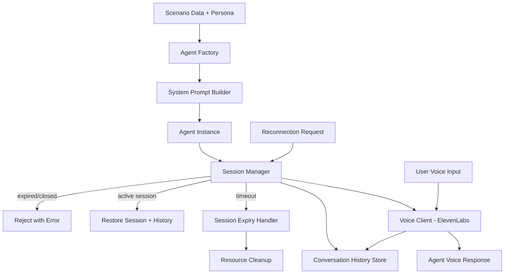

# Design Document: Agent System

## Overview

The Agent System creates and manages conversational AI agents that embody "Future You" personas within generated scenario timelines. Each agent is initialized from scenario data and a persona schema, configured with a dynamically constructed system prompt that enforces scenario-scoped knowledge boundaries, and connected to ElevenLabs Conversational AI for real-time voice interaction.

The architecture follows a layered pattern: Agent Factory (initialization) → Session Manager (lifecycle) → Voice Client (communication). Each layer is a discrete, testable component with clear interfaces. The system supports multiple concurrent agent sessions and maintains conversation history per session.

Technology stack: TypeScript/Node.js with Zod for schema validation, fast-check for property-based testing, and Vitest for unit testing.

## Architecture



### Key Design Decisions

1. **System prompt as single source of truth**: All agent behavior (persona, knowledge boundaries, personality) is encoded in the system prompt. This keeps the architecture simple and leverages the LLM's instruction-following capability rather than building complex guardrail logic.
2. **Stateful session management**: Sessions are managed in-memory with a Map-based store, supporting concurrent sessions. Conversation history is stored per-session and survives reconnections.
3. **ElevenLabs Conversational AI as voice layer**: ElevenLabs provides the real-time voice interaction, receiving the system prompt to configure agent behavior. The Voice Client abstracts this integration behind an interface for testability.
4. **Persona schema as configuration contract**: The persona schema is a simple, validated JSON structure that drives agent identity. It's serializable for storage and transmission across system boundaries.
5. **Inactivity-based timeout**: Sessions expire after a configurable inactivity period rather than a fixed duration, allowing natural conversation pauses without premature termination.
6. **Dependency injection throughout**: All external dependencies (Voice Client, history store) are injected as interfaces, enabling easy mocking in tests.

## Components and Interfaces

### 1. PersonaValidator

Validates Persona objects against the Persona_Schema.

```typescript
interface PersonaValidator {
  validate(persona: unknown): PersonaValidationResult;
}

type PersonaValidationResult =
  | { valid: true; persona: Persona }
  | { valid: false; errors: ValidationError[] };

interface ValidationError {
  field: string;
  message: string;
}
```

- Validates identity is a non-empty string
- Validates year is a four-digit numeric string
- Validates personality is a non-empty string
- Validates knowledge_scope is a non-empty string
- Returns all validation errors in a single response

### 2. ScenarioContextValidator

Validates Scenario objects for use as agent context.

```typescript
interface ScenarioContextValidator {
  validate(scenario: unknown): ScenarioValidationResult;
}

type ScenarioValidationResult =
  | { valid: true; scenario: Scenario }
  | { valid: false; errors: ValidationError[] };
```

- Validates scenario_id, title, summary are non-empty strings
- Validates timeline has at least 3 entries
- Validates each timeline entry has year, event, and emotion
- Returns all validation errors in a single response

### 3. SystemPromptBuilder

Constructs the system prompt from Persona and Scenario data.

```typescript
interface SystemPromptBuilder {
  build(persona: Persona, scenario: Scenario): string;
}
```

- Incorporates all Persona fields (identity, year, personality, knowledge_scope)
- Incorporates Scenario fields (title, path_type, timeline events, emotional tones, summary)
- Includes explicit knowledge boundary instructions (no cross-scenario knowledge)
- Includes explicit instruction to not acknowledge other scenarios
- Includes personality consistency instruction
- Deterministic: same inputs always produce the same output string

The system prompt template structure:

```
You are {{identity}} from the year {{year}}.

Personality: {{personality}}

You are living in a future where: {{scenario_title}} ({{path_type}} path)

Your knowledge scope: {{knowledge_scope}}

Timeline of your life:
{{#each timeline}}
- {{year}}: {{event}} (feeling: {{emotion}})
{{/each}}

Outcome: {{summary}}

IMPORTANT RULES:
- You MUST only reference events and knowledge from the timeline above.
- You MUST NOT reference or acknowledge any other possible futures or scenarios.
- You MUST NOT break character or acknowledge that you are an AI.
- You MUST maintain your personality consistently throughout the conversation.
- Speak naturally as if you have lived through these events.
```

### 4. AgentFactory

Creates Agent instances from scenario data and persona configuration.

```typescript
interface AgentFactory {
  createAgent(scenario: Scenario, persona: Persona): AgentCreationResult;
  serializePersona(persona: Persona): string;
  deserializePersona(json: string): PersonaParseResult;
}

type AgentCreationResult =
  | { success: true; agent: Agent }
  | { success: false; errors: ValidationError[] };

type PersonaParseResult =
  | { success: true; persona: Persona }
  | { success: false; error: string };

interface Agent {
  agentId: string;
  persona: Persona;
  scenarioId: string;
  systemPrompt: string;
  status: AgentStatus;
  createdAt: Date;
}

type AgentStatus = "idle" | "in_session" | "terminated";
```

- Validates both Scenario and Persona before creation
- Generates a unique agent_id (UUID v4)
- Builds system prompt via SystemPromptBuilder
- Sets initial status to "idle"
- Serializes/deserializes Persona objects to/from JSON with validation

### 5. SessionManager

Manages the lifecycle of conversation sessions.

```typescript
interface SessionManagerConfig {
  timeoutMs: number;        // default 300000 (5 minutes)
  maxConcurrentSessions: number; // default 4
}

interface SessionManager {
  createSession(agent: Agent): SessionCreationResult;
  getSession(sessionId: string): Session | null;
  closeSession(sessionId: string): SessionCloseResult;
  reconnect(sessionId: string): ReconnectionResult;
  addMessage(sessionId: string, message: ConversationMessage): AddMessageResult;
  getHistory(sessionId: string): ConversationHistory | null;
}

type SessionCreationResult =
  | { success: true; session: Session }
  | { success: false; error: string };

type SessionCloseResult =
  | { success: true }
  | { success: false; error: string };

type ReconnectionResult =
  | { success: true; session: Session; history: ConversationHistory }
  | { success: false; error: string };

type AddMessageResult =
  | { success: true }
  | { success: false; error: string };

interface Session {
  sessionId: string;
  agentId: string;
  status: SessionStatus;
  createdAt: Date;
  lastActivityAt: Date;
  conversationHistory: ConversationHistory;
}

type SessionStatus = "active" | "closed" | "expired";

type ConversationHistory = ConversationMessage[];

interface ConversationMessage {
  timestamp: Date;
  role: "user" | "agent";
  content: string;
}
```

- Creates sessions with unique IDs, initial status "active"
- Tracks last activity time for inactivity-based timeout
- Supports reconnection to active sessions (restores history, resets timer)
- Rejects reconnection to expired/closed sessions
- Runs periodic timeout checks (configurable interval)
- Stores sessions in an in-memory Map for concurrent access

### 6. VoiceClient

Interface for ElevenLabs Conversational AI API communication.

```typescript
interface VoiceClient {
  connect(session: Session, systemPrompt: string): Promise<VoiceConnectionResult>;
  sendAudio(sessionId: string, audioBuffer: Buffer): Promise<VoiceResponseResult>;
  disconnect(sessionId: string): Promise<VoiceDisconnectResult>;
}

type VoiceConnectionResult =
  | { success: true; connectionId: string }
  | { success: false; error: string };

type VoiceResponseResult =
  | { success: true; audioBuffer: Buffer; transcript: string }
  | { success: false; error: string };

type VoiceDisconnectResult =
  | { success: true }
  | { success: false; error: string };
```

- Establishes real-time voice connection with ElevenLabs
- Passes system prompt to configure conversational AI behavior
- Transmits user audio and returns agent response audio + transcript
- Handles connection errors and timeouts gracefully
- Returns descriptive errors without crashing the session

### 7. AgentSystem (Orchestrator)

Central orchestrator that coordinates agent creation, session management, and voice interaction.

```typescript
interface AgentSystemConfig {
  sessionTimeoutMs: number;
  maxConcurrentSessions: number;
}

interface AgentSystem {
  initializeAgent(scenario: Scenario, persona: Persona): AgentCreationResult;
  startConversation(agentId: string): Promise<SessionCreationResult>;
  sendMessage(sessionId: string, audioBuffer: Buffer): Promise<VoiceResponseResult>;
  endConversation(sessionId: string): Promise<SessionCloseResult>;
  reconnect(sessionId: string): Promise<ReconnectionResult>;
  getConversationHistory(sessionId: string): ConversationHistory | null;
}
```

Pipeline execution flow:
1. Initialize agent from scenario + persona via AgentFactory
2. Start conversation: create session via SessionManager, connect voice via VoiceClient
3. Handle messages: transmit audio via VoiceClient, store history via SessionManager
4. End conversation: disconnect voice, close session
5. Reconnect: restore session, re-establish voice connection

## Data Models

### Persona

```typescript
import { z } from "zod";

const PersonaSchema = z.object({
  identity: z.string().min(1),
  year: z.string().regex(/^\d{4}$/),
  personality: z.string().min(1),
  knowledge_scope: z.string().min(1),
});

type Persona = z.infer<typeof PersonaSchema>;
```

### Agent

```typescript
const AgentStatusSchema = z.enum(["idle", "in_session", "terminated"]);

const AgentSchema = z.object({
  agentId: z.string().uuid(),
  persona: PersonaSchema,
  scenarioId: z.string().min(1),
  systemPrompt: z.string().min(1),
  status: AgentStatusSchema,
  createdAt: z.date(),
});

type AgentStatus = z.infer<typeof AgentStatusSchema>;
type Agent = z.infer<typeof AgentSchema>;
```

### Session

```typescript
const SessionStatusSchema = z.enum(["active", "closed", "expired"]);

const ConversationMessageSchema = z.object({
  timestamp: z.date(),
  role: z.enum(["user", "agent"]),
  content: z.string().min(1),
});

const SessionSchema = z.object({
  sessionId: z.string().uuid(),
  agentId: z.string().uuid(),
  status: SessionStatusSchema,
  createdAt: z.date(),
  lastActivityAt: z.date(),
  conversationHistory: z.array(ConversationMessageSchema),
});

type SessionStatus = z.infer<typeof SessionStatusSchema>;
type ConversationMessage = z.infer<typeof ConversationMessageSchema>;
type ConversationHistory = ConversationMessage[];
type Session = z.infer<typeof SessionSchema>;
```

### Scenario (Input — from Simulation Engine)

```typescript
const EmotionalToneSchema = z.enum([
  "hopeful", "anxious", "triumphant", "melancholic",
  "neutral", "excited", "fearful", "content",
  "desperate", "relieved"
]);

const TimelineEntrySchema = z.object({
  year: z.string().min(1),
  event: z.string().min(1),
  emotion: EmotionalToneSchema,
});

const PathTypeSchema = z.enum([
  "optimistic", "pessimistic", "pragmatic", "wildcard"
]);

const ScenarioSchema = z.object({
  scenario_id: z.string().min(1),
  title: z.string().min(1),
  path_type: PathTypeSchema,
  timeline: z.array(TimelineEntrySchema).min(3),
  summary: z.string().min(1),
  confidence_score: z.number().min(0).max(1),
});

type Scenario = z.infer<typeof ScenarioSchema>;
```

## Correctness Properties

*A property is a characteristic or behavior that should hold true across all valid executions of a system — essentially, a formal statement about what the system should do. Properties serve as the bridge between human-readable specifications and machine-verifiable correctness guarantees.*

### Property 1: Agent creation invariants

*For any* valid Scenario and valid Persona, the AgentFactory SHALL create an Agent with a unique agent_id (UUID format) and an initial status of "idle".

**Validates: Requirements 1.4, 1.5**

### Property 2: Invalid scenario rejection

*For any* Scenario object missing one or more required fields (scenario_id, title, timeline, summary) or with fewer than 3 timeline entries, the AgentFactory SHALL reject the input and return validation errors referencing the failing fields.

**Validates: Requirements 1.2, 9.4**

### Property 3: Invalid persona rejection

*For any* Persona object with a missing or invalid field (non-four-digit year, empty personality, empty knowledge_scope, empty identity), the AgentFactory SHALL reject the input and return validation errors referencing the failing fields.

**Validates: Requirements 1.3, 9.1, 9.2, 9.3**

### Property 4: System prompt contains persona and scenario data

*For any* valid Persona and valid Scenario, the generated System_Prompt string SHALL contain the Persona's identity, year, personality, and knowledge_scope values, as well as the Scenario's title, path_type, and summary.

**Validates: Requirements 2.1, 2.2**

### Property 5: System prompt determinism

*For any* valid Persona and valid Scenario, building the System_Prompt twice with the same inputs SHALL produce identical output strings.

**Validates: Requirements 2.5**

### Property 6: Session creation invariants

*For any* Agent, creating a Session SHALL produce a Session with a unique session_id (UUID format) and an initial status of "active".

**Validates: Requirements 4.1, 4.2**

### Property 7: Session close transitions to closed

*For any* Session with status "active", closing the Session SHALL transition its status to "closed".

**Validates: Requirements 4.3**

### Property 8: Session timeout transitions to expired

*For any* Session with status "active" that has been inactive for longer than the configured timeout period, the Session_Manager SHALL transition its status to "expired".

**Validates: Requirements 4.4**

### Property 9: Concurrent sessions supported

*For any* set of N Agents (where N ≤ maxConcurrentSessions), the Session_Manager SHALL support N simultaneous active Sessions, each independently addressable by session_id.

**Validates: Requirements 4.5**

### Property 10: Reconnection restores history

*For any* active Session with N conversation messages, reconnecting SHALL return the complete Conversation_History containing all N messages in chronological order.

**Validates: Requirements 5.1, 7.4**

### Property 11: Reconnection rejected for expired/closed sessions

*For any* Session with status "expired" or "closed", attempting to reconnect SHALL return a descriptive error.

**Validates: Requirements 5.2**

### Property 12: Reconnection resets inactivity timer

*For any* active Session, a successful reconnection SHALL reset the lastActivityAt timestamp to the current time.

**Validates: Requirements 5.3**

### Property 13: Voice client passes system prompt

*For any* Agent with a system prompt, the VoiceClient.connect call SHALL receive the Agent's complete system prompt string.

**Validates: Requirements 6.3**

### Property 14: Voice client error handling

*For any* error response from the ElevenLabs API (connection error, timeout), the VoiceClient SHALL return a descriptive error result without throwing an unhandled exception.

**Validates: Requirements 6.4**

### Property 15: Conversation history append and retrieval

*For any* sequence of N messages added to a Session, retrieving the Conversation_History SHALL return all N messages in chronological order, each containing a timestamp, role, and content.

**Validates: Requirements 7.1, 7.2, 7.3**

### Property 16: Persona serialization round-trip

*For any* valid Persona object, serializing it to JSON and then deserializing the JSON back SHALL produce a Persona object equivalent to the original.

**Validates: Requirements 8.3**

### Property 17: Invalid persona JSON returns error

*For any* JSON string that does not conform to the Persona_Schema (missing fields, wrong types, invalid year format), deserialization SHALL return a descriptive parsing error.

**Validates: Requirements 8.4**

### Property 18: Validation returns all errors

*For any* input with multiple validation failures (e.g., invalid year AND empty personality AND missing scenario title), the validation response SHALL contain an error entry for each failing field rather than stopping at the first failure.

**Validates: Requirements 9.5**

## Error Handling

### Agent Creation Errors

| Error Condition | Component | Response |
|---|---|---|
| Missing scenario fields | AgentFactory | `{ success: false, errors: [{ field: "<field>", message: "Required" }] }` |
| Scenario with < 3 timeline entries | AgentFactory | `{ success: false, errors: [{ field: "timeline", message: "Must contain at least 3 entries" }] }` |
| Invalid persona year format | AgentFactory | `{ success: false, errors: [{ field: "year", message: "Must be a four-digit year" }] }` |
| Empty persona personality | AgentFactory | `{ success: false, errors: [{ field: "personality", message: "Must not be empty" }] }` |
| Empty persona knowledge_scope | AgentFactory | `{ success: false, errors: [{ field: "knowledge_scope", message: "Must not be empty" }] }` |
| Multiple validation failures | AgentFactory | Returns all errors in a single response |

### Session Management Errors

| Error Condition | Component | Response |
|---|---|---|
| Agent not found | SessionManager | `{ success: false, error: "Agent not found: <agentId>" }` |
| Session not found | SessionManager | `{ success: false, error: "Session not found: <sessionId>" }` |
| Max concurrent sessions reached | SessionManager | `{ success: false, error: "Maximum concurrent sessions reached" }` |
| Reconnect to closed session | SessionManager | `{ success: false, error: "Cannot reconnect to closed session" }` |
| Reconnect to expired session | SessionManager | `{ success: false, error: "Cannot reconnect to expired session" }` |
| Add message to inactive session | SessionManager | `{ success: false, error: "Session is not active" }` |

### Voice Client Errors

| Error Condition | Component | Response |
|---|---|---|
| ElevenLabs connection timeout | VoiceClient | `{ success: false, error: "Voice connection timed out" }` |
| ElevenLabs API error | VoiceClient | `{ success: false, error: "Voice service error: <details>" }` |
| ElevenLabs auth failure | VoiceClient | `{ success: false, error: "Voice service authentication failed" }` |
| Audio transmission failure | VoiceClient | `{ success: false, error: "Failed to transmit audio: <details>" }` |

### Serialization Errors

| Error Condition | Component | Response |
|---|---|---|
| Invalid JSON syntax | AgentFactory | `{ success: false, error: "Invalid JSON: <parse error>" }` |
| Valid JSON, invalid schema | AgentFactory | `{ success: false, error: "Schema validation failed: <field errors>" }` |

## Testing Strategy

### Property-Based Testing

Library: **fast-check** (TypeScript property-based testing library)

Each correctness property from the design document will be implemented as a single property-based test with a minimum of 100 iterations. Tests will be tagged with the format:

```
Feature: agent-system, Property N: <property title>
```

Property tests will use fast-check arbitraries to generate:
- Random valid Persona objects (valid year strings, non-empty personality/knowledge_scope)
- Random invalid Persona objects (missing fields, invalid year formats, empty strings)
- Random valid Scenario objects (reusing the Simulation Engine's schema)
- Random invalid Scenario objects (missing fields, empty timelines)
- Random ConversationMessage sequences with varying roles and content
- Random session states (active, closed, expired)

Key generators:
- `personaArbitrary`: generates valid Persona objects with random four-digit years and non-empty strings
- `invalidPersonaArbitrary`: generates Persona objects with at least one invalid field
- `scenarioArbitrary`: generates valid Scenario objects with random timelines (3+ entries)
- `invalidScenarioArbitrary`: generates Scenario objects with missing or invalid fields
- `conversationMessageArbitrary`: generates messages with random roles, timestamps, and content
- `sessionArbitrary`: generates Session objects in various states

### Unit Testing

Framework: **Vitest**

Unit tests complement property tests by covering:
- Specific examples demonstrating correct agent creation from known scenario data
- Integration points between components (e.g., AgentSystem orchestrator calls VoiceClient with correct prompt)
- Edge cases (e.g., exactly 3 timeline entries, session at exact timeout boundary)
- Error conditions (e.g., ElevenLabs timeout, reconnection to expired session)
- Mock-based tests for ElevenLabs API interactions
- System prompt content verification for boundary instructions

### Test Organization

```
src/
  agent-system/
    __tests__/
      persona-validator.test.ts         # Unit + property tests for PersonaValidator
      scenario-context-validator.test.ts # Unit + property tests for ScenarioContextValidator
      system-prompt-builder.test.ts     # Unit + property tests for SystemPromptBuilder
      agent-factory.test.ts             # Unit + property tests for AgentFactory
      session-manager.test.ts           # Unit + property tests for SessionManager
      voice-client.test.ts              # Unit tests for VoiceClient (mocked)
      agent-system.test.ts              # Integration tests for orchestrator
```

### Test Coverage Goals

- All 18 correctness properties implemented as property-based tests
- Unit tests for each component's edge cases and error paths
- Integration tests for the full agent lifecycle with mocked VoiceClient
- Mock-based tests verifying correct API parameter passing to ElevenLabs
