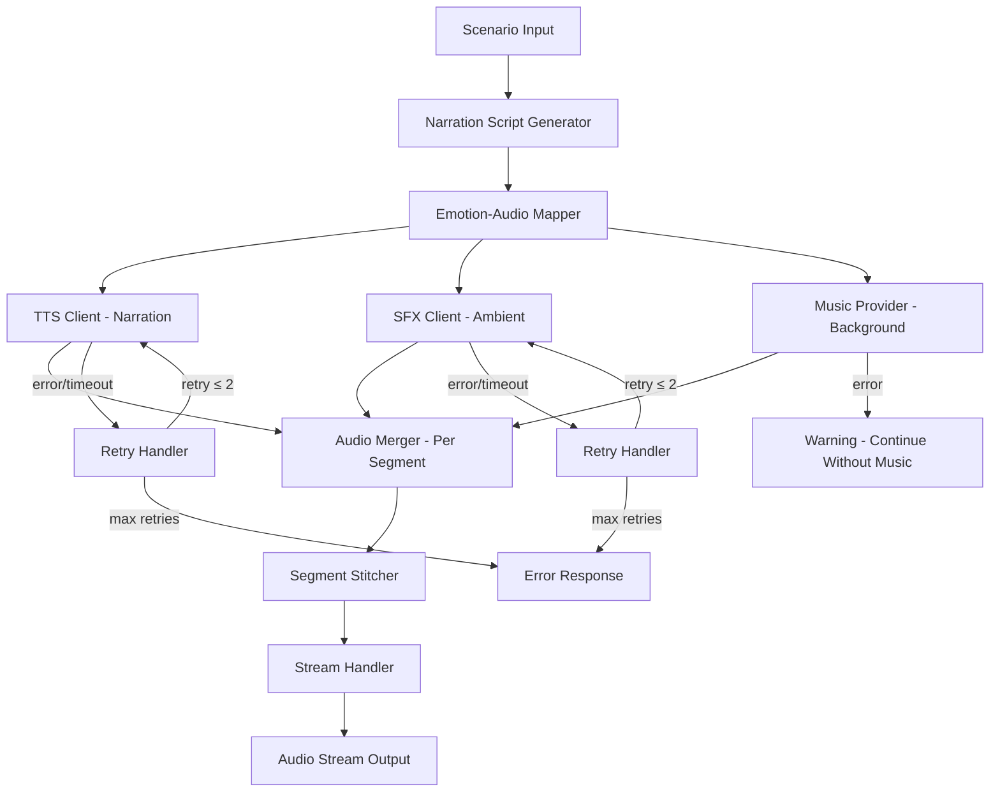

# Design Document: Audio Pipeline

## Overview

The Audio Pipeline transforms Scenario objects from the Simulation Engine into immersive, layered audio experiences. Each scenario's timeline is converted into a narration script, then each timeline point is rendered as three synchronized audio layers: spoken narration (via ElevenLabs TTS), ambient sound effects (via ElevenLabs SFX), and background music (via a mood-mapped music provider). These layers are merged per-segment, stitched into a continuous track with crossfade transitions, and delivered as a streamable audio output.

The architecture follows a staged pipeline: Script Generation → Emotion Mapping → Parallel Audio Generation → Layer Merging → Segment Stitching → Stream Output. Each stage is a discrete, testable component with clear interfaces.

Technology stack: TypeScript/Node.js with Zod for schema validation, fast-check for property-based testing, and Vitest for unit testing.

## Architecture



### Key Design Decisions

1. **Parallel audio generation per segment**: Narration, ambient, and music for each segment are generated concurrently (Promise.all) to minimize latency. This is critical for demo performance.
2. **Narration as duration reference**: The narration track sets the duration for each segment. Ambient and music are trimmed or looped to match, ensuring narration is always fully audible.
3. **Graceful music degradation**: Music failures produce a warning and the segment continues with available layers. Narration and ambient failures are retried and escalated as errors since they are more critical.
4. **Streaming from first segment**: The Stream Handler begins output as soon as the first Audio_Segment is merged, enabling real-time playback without waiting for full generation.
5. **ElevenLabs as primary audio provider**: ElevenLabs TTS and Sound Effects APIs provide high-quality, emotion-aware audio generation. Music uses a mood-mapped provider (pre-mapped library or generation API).
6. **Intro/outro segments**: The script generator produces an introductory segment (scenario title) and a concluding segment (scenario summary) bookending the timeline segments.

## Components and Interfaces

### 1. NarrationScriptGenerator

Converts a Scenario into a structured Narration_Script with one Script_Segment per timeline entry, plus intro and outro segments.

```typescript
interface NarrationScriptGenerator {
  generate(scenario: Scenario): NarrationScript;
}

interface NarrationScript {
  scenarioId: string;
  segments: ScriptSegment[];
}

interface ScriptSegment {
  index: number;
  type: "intro" | "timeline" | "outro";
  narrationText: string;
  emotionalTone: EmotionalTone;
}
```

- Produces intro segment from scenario title and path_type
- Produces one timeline segment per Timeline_Entry, incorporating year, event, and context
- Produces outro segment from scenario summary
- Total segments = timeline.length + 2 (intro + outro)
- Preserves Emotional_Tone from each Timeline_Entry; intro uses first timeline tone, outro uses last

### 2. EmotionAudioMapper

Maps each Emotional_Tone to audio generation parameters for all three layers.

```typescript
interface EmotionAudioMapper {
  map(tone: EmotionalTone): AudioStyleParams;
  getAllMappings(): EmotionAudioMap;
}

interface AudioStyleParams {
  voiceStyle: VoiceStyle;
  ambientDescriptor: string;
  musicMood: string;
}

interface VoiceStyle {
  stability: number;       // 0-1, ElevenLabs parameter
  similarityBoost: number; // 0-1, ElevenLabs parameter
  style: number;           // 0-1, ElevenLabs parameter
  speakingRate: number;    // 0.5-2.0, speech speed multiplier
}

type EmotionAudioMap = Record<EmotionalTone, AudioStyleParams>;
```

Default mappings:

| Emotional Tone | Voice Style (stability/similarity/style/rate) | Ambient Descriptor | Music Mood |
|---|---|---|---|
| hopeful | 0.7 / 0.8 / 0.6 / 1.0 | "birds chirping, gentle breeze" | "uplifting orchestral" |
| anxious | 0.4 / 0.7 / 0.8 / 1.2 | "ticking clock, distant thunder" | "tense strings" |
| triumphant | 0.8 / 0.9 / 0.9 / 0.9 | "crowd cheering, fireworks" | "epic orchestral fanfare" |
| melancholic | 0.6 / 0.8 / 0.7 / 0.8 | "gentle rain, distant wind" | "slow piano melody" |
| neutral | 0.7 / 0.7 / 0.5 / 1.0 | "soft white noise, office ambiance" | "minimal ambient" |
| excited | 0.5 / 0.8 / 0.9 / 1.1 | "bustling city, energetic crowd" | "upbeat electronic" |
| fearful | 0.3 / 0.6 / 0.8 / 1.3 | "howling wind, creaking doors" | "dark suspenseful drone" |
| content | 0.8 / 0.8 / 0.5 / 0.9 | "crackling fireplace, soft rain" | "warm acoustic guitar" |
| desperate | 0.3 / 0.5 / 0.9 / 1.4 | "sirens, heavy rain, thunder" | "intense dramatic strings" |
| relieved | 0.7 / 0.9 / 0.6 / 0.9 | "ocean waves, birds singing" | "gentle piano resolution" |

- Falls back to neutral mapping for unknown tones, emitting a warning
- Deterministic: same tone always returns same parameters

### 3. TTSClient

Interface for ElevenLabs Text-to-Speech API communication.

```typescript
interface TTSClient {
  synthesize(text: string, voiceStyle: VoiceStyle): Promise<TTSResult>;
}

type TTSResult =
  | { success: true; audioBuffer: Buffer; durationMs: number; format: AudioFormat }
  | { success: false; error: string };

type AudioFormat = "mp3" | "pcm";
```

- Sends narration text with voice style parameters to ElevenLabs TTS API
- Returns audio buffer with duration metadata
- Timeout: 30 seconds per request

### 4. SFXClient

Interface for ElevenLabs Sound Effects API communication.

```typescript
interface SFXClient {
  generate(descriptor: string, durationMs: number): Promise<SFXResult>;
}

type SFXResult =
  | { success: true; audioBuffer: Buffer; durationMs: number; format: AudioFormat }
  | { success: false; error: string };
```

- Sends ambient descriptor text and target duration to ElevenLabs SFX API
- Returns audio buffer with duration metadata
- Timeout: 30 seconds per request

### 5. MusicProvider

Interface for background music selection or generation.

```typescript
interface MusicProvider {
  getTrack(mood: string, durationMs: number): Promise<MusicResult>;
}

type MusicResult =
  | { success: true; audioBuffer: Buffer; durationMs: number; format: AudioFormat }
  | { success: false; error: string };
```

- Selects or generates a music track matching the mood and target duration
- Can be backed by a pre-mapped library or a generation API
- Returns audio buffer with duration metadata

### 6. AudioMerger

Combines the three audio layers per segment and stitches segments into a complete experience.

```typescript
interface AudioMerger {
  mergeSegment(layers: AudioLayers): AudioSegment;
  stitchSegments(segments: AudioSegment[], crossfadeMs: number): AudioExperience;
}

interface AudioLayers {
  narration: AudioTrack;
  ambient?: AudioTrack;
  music?: AudioTrack;
}

interface AudioTrack {
  audioBuffer: Buffer;
  durationMs: number;
  format: AudioFormat;
}

interface AudioSegment {
  index: number;
  audioBuffer: Buffer;
  durationMs: number;
  format: AudioFormat;
}

interface AudioExperience {
  scenarioId: string;
  audioBuffer: Buffer;
  totalDurationMs: number;
  segmentCount: number;
  format: AudioFormat;
}
```

- `mergeSegment`: overlays ambient and music onto narration, using narration duration as reference
- Trims longer layers, loops shorter layers to match narration duration
- Volume levels: narration at 100%, ambient at 30%, music at 20%
- `stitchSegments`: concatenates segments in order with crossfade transitions (default 500ms)
- Handles missing ambient or music layers gracefully

### 7. StreamHandler

Delivers audio output as a streamable format.

```typescript
interface StreamHandler {
  createStream(scenarioId: string): AudioStream;
  pushSegment(stream: AudioStream, segment: AudioSegment): void;
  endStream(stream: AudioStream): void;
  errorStream(stream: AudioStream, error: string): void;
}

interface AudioStream {
  scenarioId: string;
  state: "open" | "completed" | "error";
  readable: ReadableStream<Buffer>;
}
```

- Creates a readable stream that clients can consume
- Pushes segments as they become available (no waiting for full generation)
- Signals completion or error states
- Compatible with HTTP streaming responses

### 8. AudioPipeline (Orchestrator)

Central orchestrator that coordinates the full audio generation pipeline.

```typescript
interface AudioPipelineConfig {
  maxRetries: number;          // default 2
  crossfadeMs: number;         // default 500
  streamingEnabled: boolean;   // default true
}

interface AudioPipeline {
  process(scenario: Scenario, config?: Partial<AudioPipelineConfig>): Promise<AudioPipelineResult>;
}

type AudioPipelineResult =
  | { success: true; experience: AudioExperience; stream?: AudioStream }
  | { success: false; error: string };
```

Pipeline execution flow:
1. Generate narration script from scenario
2. For each script segment (in order):
   a. Look up audio style params via EmotionAudioMapper
   b. Generate narration, ambient, and music concurrently (Promise.all)
   c. Retry narration/ambient on failure (up to maxRetries)
   d. Continue without music on failure (log warning)
   e. Merge layers into AudioSegment
   f. Push segment to stream (if streaming enabled)
3. Stitch all segments with crossfade transitions
4. Signal stream completion
5. Return AudioExperience

### 9. EmotionAudioMapSerializer

Handles JSON serialization and deserialization of EmotionAudioMap objects.

```typescript
interface EmotionAudioMapSerializer {
  serialize(map: EmotionAudioMap): string;
  deserialize(json: string): EmotionAudioMapParseResult;
}

type EmotionAudioMapParseResult =
  | { success: true; map: EmotionAudioMap }
  | { success: false; error: string };
```

- `serialize`: converts an EmotionAudioMap to a JSON string
- `deserialize`: parses a JSON string and validates it against the EmotionAudioMap schema
- Round-trip property: `deserialize(serialize(map))` equals the original map

## Data Models

### Scenario (Input - from Simulation Engine)

```typescript
import { z } from "zod";

const EmotionalToneSchema = z.enum([
  "hopeful", "anxious", "triumphant", "melancholic",
  "neutral", "excited", "fearful", "content",
  "desperate", "relieved"
]);

const TimelineEntrySchema = z.object({
  year: z.string().min(1),
  event: z.string().min(1),
  emotion: EmotionalToneSchema,
});

const PathTypeSchema = z.enum([
  "optimistic", "pessimistic", "pragmatic", "wildcard"
]);

const ScenarioSchema = z.object({
  scenario_id: z.string().min(1),
  title: z.string().min(1),
  path_type: PathTypeSchema,
  timeline: z.array(TimelineEntrySchema).min(3),
  summary: z.string().min(1),
  confidence_score: z.number().min(0).max(1),
});

type EmotionalTone = z.infer<typeof EmotionalToneSchema>;
type TimelineEntry = z.infer<typeof TimelineEntrySchema>;
type Scenario = z.infer<typeof ScenarioSchema>;
```

### NarrationScript

```typescript
const ScriptSegmentSchema = z.object({
  index: z.number().int().min(0),
  type: z.enum(["intro", "timeline", "outro"]),
  narrationText: z.string().min(1),
  emotionalTone: EmotionalToneSchema,
});

const NarrationScriptSchema = z.object({
  scenarioId: z.string().min(1),
  segments: z.array(ScriptSegmentSchema).min(3), // at least intro + 1 timeline + outro
});

type ScriptSegment = z.infer<typeof ScriptSegmentSchema>;
type NarrationScript = z.infer<typeof NarrationScriptSchema>;
```

### AudioStyleParams

```typescript
const VoiceStyleSchema = z.object({
  stability: z.number().min(0).max(1),
  similarityBoost: z.number().min(0).max(1),
  style: z.number().min(0).max(1),
  speakingRate: z.number().min(0.5).max(2.0),
});

const AudioStyleParamsSchema = z.object({
  voiceStyle: VoiceStyleSchema,
  ambientDescriptor: z.string().min(1),
  musicMood: z.string().min(1),
});

const EmotionAudioMapSchema = z.record(EmotionalToneSchema, AudioStyleParamsSchema);

type VoiceStyle = z.infer<typeof VoiceStyleSchema>;
type AudioStyleParams = z.infer<typeof AudioStyleParamsSchema>;
type EmotionAudioMap = z.infer<typeof EmotionAudioMapSchema>;
```

### AudioSegment and AudioExperience

```typescript
const AudioFormatSchema = z.enum(["mp3", "pcm"]);

const AudioSegmentSchema = z.object({
  index: z.number().int().min(0),
  audioBuffer: z.instanceof(Buffer),
  durationMs: z.number().positive(),
  format: AudioFormatSchema,
});

const AudioExperienceSchema = z.object({
  scenarioId: z.string().min(1),
  audioBuffer: z.instanceof(Buffer),
  totalDurationMs: z.number().positive(),
  segmentCount: z.number().int().positive(),
  format: AudioFormatSchema,
});

type AudioFormat = z.infer<typeof AudioFormatSchema>;
type AudioSegment = z.infer<typeof AudioSegmentSchema>;
type AudioExperience = z.infer<typeof AudioExperienceSchema>;
```


## Correctness Properties

*A property is a characteristic or behavior that should hold true across all valid executions of a system — essentially, a formal statement about what the system should do. Properties serve as the bridge between human-readable specifications and machine-verifiable correctness guarantees.*

### Property 1: Script segment count matches timeline length

*For any* valid Scenario with N Timeline_Entry items, the NarrationScriptGenerator SHALL produce a NarrationScript with exactly N segments of type "timeline".

**Validates: Requirements 1.1, 1.3**

### Property 2: Script segments incorporate scenario context

*For any* valid Scenario, each timeline-type ScriptSegment's narrationText SHALL contain the corresponding Timeline_Entry's year label, event description, and the scenario title.

**Validates: Requirements 1.2**

### Property 3: Emotional tone preservation in script segments

*For any* valid Scenario, each timeline-type ScriptSegment SHALL have an emotionalTone equal to the EmotionalTone of the corresponding Timeline_Entry.

**Validates: Requirements 1.4**

### Property 4: Intro and outro segments present in narration script

*For any* valid Scenario, the NarrationScript SHALL have its first segment of type "intro" containing the scenario title, and its last segment of type "outro" containing the scenario summary.

**Validates: Requirements 1.5**

### Property 5: Emotion map completeness and consistency

*For any* valid EmotionalTone, calling the EmotionAudioMapper twice with the same tone SHALL return identical AudioStyleParams containing a VoiceStyle, an ambientDescriptor, and a musicMood.

**Validates: Requirements 2.2, 2.3**

### Property 6: Invalid tone falls back to neutral

*For any* string that is not a valid EmotionalTone, the EmotionAudioMapper SHALL return the same AudioStyleParams as for the "neutral" tone.

**Validates: Requirements 2.4**

### Property 7: Correct audio style params passed to all clients

*For any* ScriptSegment with a given EmotionalTone, the Audio_Pipeline SHALL pass the VoiceStyle from the EmotionAudioMapper to the TTS_Client, the ambientDescriptor to the SFX_Client, and the musicMood to the Music_Provider.

**Validates: Requirements 3.1, 4.1, 5.1**

### Property 8: Valid audio buffer format from all clients

*For any* successful audio generation (narration, ambient, or music), the returned audio buffer SHALL be in a supported format (MP3 or PCM) with a positive duration.

**Validates: Requirements 3.2, 4.2, 5.2**

### Property 9: Retry behavior for critical audio clients

*For any* TTS_Client or SFX_Client failure, the Audio_Pipeline SHALL retry up to 2 additional times. If all retries fail, the pipeline SHALL return a descriptive error.

**Validates: Requirements 3.3, 4.3**

### Property 10: Segment processing in timeline order

*For any* NarrationScript with multiple segments, the Audio_Pipeline SHALL generate audio for segments in ascending index order.

**Validates: Requirements 3.4**

### Property 11: Duration request for ambient and music matches narration

*For any* ScriptSegment, the duration requested from the SFX_Client and Music_Provider SHALL be greater than or equal to the narration audio duration for that segment.

**Validates: Requirements 4.4, 5.4**

### Property 12: Graceful music degradation

*For any* Music_Provider failure, the Audio_Pipeline SHALL continue processing the segment without music and log a warning, rather than failing the entire pipeline.

**Validates: Requirements 5.3**

### Property 13: Merged segment duration equals narration duration

*For any* set of audio layers (narration, ambient, music) with varying durations, the AudioMerger SHALL produce an AudioSegment whose duration equals the narration audio duration — trimming longer layers and looping shorter layers as needed.

**Validates: Requirements 6.2, 6.3, 6.4**

### Property 14: Volume balancing ratios applied

*For any* merged AudioSegment, the AudioMerger SHALL apply volume scaling such that narration is at 100%, ambient at 30%, and music at 20%.

**Validates: Requirements 6.5**

### Property 15: Merger handles missing layers

*For any* combination of available audio layers where at least narration is present, the AudioMerger SHALL produce a valid AudioSegment using only the available layers.

**Validates: Requirements 6.6**

### Property 16: Stitching preserves timeline order

*For any* ordered list of AudioSegments, the AudioMerger.stitchSegments SHALL concatenate them in the provided order into a single AudioExperience.

**Validates: Requirements 7.1, 7.3**

### Property 17: Crossfade reduces total duration

*For any* list of N AudioSegments (N ≥ 2) with crossfade duration C, the stitched AudioExperience total duration SHALL equal the sum of segment durations minus (N-1) × C.

**Validates: Requirements 7.2**

### Property 18: Audio experience includes intro and outro

*For any* Scenario processed through the full pipeline, the resulting AudioExperience SHALL have its first segment corresponding to the intro and its last segment corresponding to the outro.

**Validates: Requirements 7.4**

### Property 19: Stream delivers segments in order

*For any* sequence of AudioSegments pushed to a StreamHandler, the readable stream SHALL deliver audio data in the same order, with the first segment available immediately after being pushed.

**Validates: Requirements 8.1, 8.2**

### Property 20: Stream error handling

*For any* AudioStream in "open" state, calling errorStream SHALL transition the stream state to "error" and signal the error to the readable stream consumer.

**Validates: Requirements 8.4**

### Property 21: Stream completion signaling

*For any* AudioStream in "open" state, calling endStream SHALL transition the stream state to "completed" and close the readable stream.

**Validates: Requirements 8.5**

### Property 22: EmotionAudioMap serialization round-trip

*For any* valid EmotionAudioMap object, serializing it to JSON and then deserializing the JSON back SHALL produce an EmotionAudioMap equivalent to the original.

**Validates: Requirements 9.3**

### Property 23: Invalid JSON deserialization returns error

*For any* JSON string that does not conform to the EmotionAudioMap schema (missing fields, wrong types, out-of-range values), deserialization SHALL return a descriptive parsing error rather than an EmotionAudioMap object.

**Validates: Requirements 9.4**

## Error Handling

### Audio Generation Errors

| Error Condition | Component | Response |
|---|---|---|
| TTS API timeout | TTSClient | Retry up to 2 times, then return `{ success: false, error: "TTS request timed out after 3 attempts" }` |
| TTS API error (rate limit, auth) | TTSClient | Retry up to 2 times, then return `{ success: false, error: "TTS service error: <details>" }` |
| SFX API timeout | SFXClient | Retry up to 2 times, then return `{ success: false, error: "SFX request timed out after 3 attempts" }` |
| SFX API error | SFXClient | Retry up to 2 times, then return `{ success: false, error: "SFX service error: <details>" }` |
| Music provider error | MusicProvider | Log warning, continue without music for that segment |
| Music provider timeout | MusicProvider | Log warning, continue without music for that segment |

### Audio Merging Errors

| Error Condition | Component | Response |
|---|---|---|
| Narration audio missing | AudioMerger | Return `{ success: false, error: "Narration audio is required for segment <index>" }` |
| Ambient audio missing | AudioMerger | Merge with available layers (narration + music only) |
| Music audio missing | AudioMerger | Merge with available layers (narration + ambient only) |
| Empty segment list for stitching | AudioMerger | Return `{ success: false, error: "No segments to stitch" }` |
| Invalid audio format | AudioMerger | Return `{ success: false, error: "Unsupported audio format: <format>" }` |

### Streaming Errors

| Error Condition | Component | Response |
|---|---|---|
| Stream already completed | StreamHandler | Ignore push, log warning |
| Stream already errored | StreamHandler | Ignore push, log warning |
| Segment generation failure mid-stream | StreamHandler | Call errorStream with descriptive error, terminate stream |

### Serialization Errors

| Error Condition | Component | Response |
|---|---|---|
| Invalid JSON syntax | EmotionAudioMapSerializer | Return `{ success: false, error: "Invalid JSON: <parse error>" }` |
| Valid JSON, invalid schema | EmotionAudioMapSerializer | Return `{ success: false, error: "Schema validation failed: <field errors>" }` |

### Input Validation Errors

| Error Condition | Component | Response |
|---|---|---|
| Invalid Scenario (fails Zod validation) | AudioPipeline | Return `{ success: false, error: "Invalid scenario input: <validation errors>" }` |
| Empty timeline | AudioPipeline | Return `{ success: false, error: "Scenario must have at least 3 timeline entries" }` |

## Testing Strategy

### Property-Based Testing

Library: **fast-check** (TypeScript property-based testing library)

Each correctness property from the design document will be implemented as a single property-based test with a minimum of 100 iterations. Tests will be tagged with the format:

```
Feature: audio-pipeline, Property N: <property title>
```

Property tests will use fast-check arbitraries to generate:
- Random valid Scenario objects (reusing the Simulation Engine's schema)
- Random valid EmotionalTone values
- Random invalid tone strings
- Random audio buffers with varying durations
- Random AudioStyleParams and EmotionAudioMap objects
- Random combinations of available/missing audio layers

Key generators:
- `scenarioArbitrary`: generates valid Scenario objects with random timelines (3+ entries)
- `emotionalToneArbitrary`: picks from the 10 valid tones
- `audioBufferArbitrary`: generates random Buffer objects with associated duration
- `audioLayersArbitrary`: generates AudioLayers with optional ambient/music
- `emotionAudioMapArbitrary`: generates complete EmotionAudioMap objects

### Unit Testing

Framework: **Vitest**

Unit tests complement property tests by covering:
- Specific examples demonstrating correct narration script generation
- Integration points between components (e.g., pipeline passes correct params to TTS client)
- Edge cases (e.g., scenario with exactly 3 timeline entries, single segment)
- Error conditions (e.g., all retries exhausted, stream error mid-delivery)
- Mock-based tests for ElevenLabs API interactions
- Volume balancing verification with known audio samples

### Test Organization

```
src/
  audio-pipeline/
    __tests__/
      narration-script-generator.test.ts  # Unit + property tests for script generation
      emotion-audio-mapper.test.ts        # Unit + property tests for emotion mapping
      audio-merger.test.ts                # Unit + property tests for merging and stitching
      stream-handler.test.ts              # Unit + property tests for streaming
      emotion-audio-map-serializer.test.ts # Unit + property tests for serialization
      audio-pipeline.test.ts              # Integration tests for full pipeline
```

### Test Coverage Goals

- All 23 correctness properties implemented as property-based tests
- Unit tests for each component's edge cases and error paths
- Integration tests for the full pipeline with mocked audio clients (TTS, SFX, Music)
- Mock-based tests verifying correct API parameter passing to ElevenLabs
