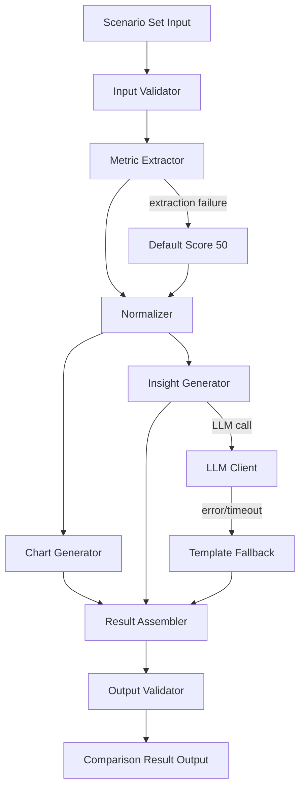

# Design Document: Comparison Engine

## Overview

The Comparison Engine takes generated scenarios from the Simulation Engine and produces normalized metrics, visual comparison data, and AI-generated insights. It enables users to compare 2–4 futures across multiple dimensions (Happiness, Risk, Financial Outcome, Personal Growth, and extensible custom dimensions).

The architecture follows a scoring pipeline: input validation → metric extraction → normalization → chart data generation → insight generation. Each stage is a discrete, testable component with clear interfaces. The dimension set is configurable, allowing new comparison axes without modifying core logic.

Technology stack: TypeScript/Node.js with Zod for schema validation, fast-check for property-based testing, and Vitest for unit testing.

## Architecture



### Key Design Decisions

1. **Pipeline over event-driven**: A synchronous pipeline is simpler, easier to test, and sufficient for the comparison workload. Each stage transforms data and passes it forward.
2. **Configurable dimension registry**: Dimensions are defined as configuration objects with extraction functions, enabling extensibility without modifying core components.
3. **Zod for validation**: Zod provides runtime schema validation with TypeScript type inference for both input and output schemas.
4. **Template fallback for insights**: When the LLM is unavailable, a deterministic template-based generator produces structured summaries from metric data, ensuring the comparison always completes.
5. **Deterministic scoring pipeline**: All stages except LLM insight generation are deterministic — same inputs always produce the same outputs. This enables reliable testing and reproducible results.
6. **Default score on extraction failure**: If metric extraction fails for a dimension, a neutral default score of 50 is used rather than failing the entire comparison.

## Components and Interfaces

### 1. InputValidator

Validates incoming scenario sets before processing.

```typescript
interface InputValidator {
  validate(scenarios: unknown[]): InputValidationResult;
}

type InputValidationResult =
  | { valid: true; scenarios: Scenario[] }
  | { valid: false; errors: InputValidationError[] };

interface InputValidationError {
  scenarioIndex?: number;
  field?: string;
  message: string;
}
```

- Rejects sets with fewer than 2 or more than 4 scenarios
- Validates each scenario has required fields (scenario_id, title, timeline, summary)
- Returns all validation errors in a single response with scenario index references

### 2. MetricExtractor

Extracts raw metric values from scenario data for each configured dimension.

```typescript
interface DimensionConfig {
  name: string;
  extract: (scenario: Scenario) => number;
}

interface MetricExtractor {
  extract(scenario: Scenario, dimensions: DimensionConfig[]): RawMetrics;
}

interface RawMetrics {
  scenarioId: string;
  values: { dimension: string; rawValue: number }[];
}
```

- Produces one raw metric per configured dimension
- Deterministic: same scenario always yields the same raw metrics
- On extraction failure for a dimension, returns a default raw value that normalizes to 50

**Default Dimension Extraction Logic:**

- **Happiness**: Scores based on emotional tone distribution. Positive tones (hopeful, triumphant, excited, content, relieved) increase the score; negative tones (anxious, melancholic, fearful, desperate) decrease it. Score = (positive tone count / total timeline entries) × 100.
- **Risk**: Scores based on presence of negative emotional tones and risk-indicating keywords in events. Higher negative tone ratio and risk keywords yield higher risk scores.
- **Financial_Outcome**: Scores based on presence of financial keywords (e.g., "wealth", "salary", "investment", "debt", "bankrupt") in timeline events and summary. Positive financial keywords increase score; negative ones decrease it.
- **Personal_Growth**: Scores based on growth-indicating keywords (e.g., "learned", "mastered", "promoted", "achieved", "developed") in timeline events. Higher keyword density yields higher score.

### 3. Normalizer

Scales raw metric values to the 0–100 range.

```typescript
interface NormalizerConfig {
  dimension: string;
  min: number;
  max: number;
}

interface Normalizer {
  normalize(rawValue: number, config: NormalizerConfig): number;
  normalizeBatch(rawMetrics: RawMetrics, configs: NormalizerConfig[]): NormalizedMetrics;
}

interface NormalizedMetrics {
  scenarioId: string;
  values: { dimension: string; score: number; label: string }[];
}
```

- Uses min-max normalization: `score = ((rawValue - min) / (max - min)) * 100`
- Clamps output to [0, 100]
- Deterministic: same inputs always produce the same output
- Preserves relative ordering: if `a <= b` then `normalize(a) <= normalize(b)`
- Label is derived from score ranges: 0–20 "Very Low", 21–40 "Low", 41–60 "Moderate", 61–80 "High", 81–100 "Very High"

### 4. ChartGenerator

Transforms normalized metrics into radar chart data structures.

```typescript
interface ChartGenerator {
  generate(scenarioMetrics: ScenarioMetrics[]): RadarChartData;
}
```

- Produces a dimensions array with all dimension names in consistent order
- Produces one series entry per scenario with values matching dimension order
- Deterministic: same inputs always produce the same output

### 5. InsightGenerator

Produces AI-powered or template-based textual summaries comparing scenarios.

```typescript
interface InsightGenerator {
  generate(
    scenarioMetrics: ScenarioMetrics[],
    chartData: RadarChartData
  ): Promise<string>;
}
```

- Primary path: calls LLM_Client with structured prompt containing metric data
- Fallback path: generates template-based summary on LLM failure
- Template fallback includes each scenario's title, highest-scoring dimension, and lowest-scoring dimension
- Both paths produce non-empty strings referencing scenario titles and dimension names

### 6. TemplateFallbackGenerator

Deterministic template-based insight generator used when LLM is unavailable.

```typescript
interface TemplateFallbackGenerator {
  generate(scenarioMetrics: ScenarioMetrics[]): string;
}
```

- Produces a structured summary for each scenario listing its title, best dimension, and worst dimension
- Includes a comparative statement about which scenario leads in each dimension
- Fully deterministic

### 7. ComparisonEngine (Orchestrator)

Central orchestrator that coordinates the full comparison pipeline.

```typescript
interface ComparisonEngineConfig {
  dimensions: DimensionConfig[];
  normalizerConfigs: NormalizerConfig[];
}

interface ComparisonEngine {
  compare(scenarios: Scenario[]): Promise<ComparisonResult>;
}

type ComparisonResult =
  | { success: true; result: ComparisonOutput }
  | { success: false; error: string };

interface ComparisonOutput {
  scenarios: ScenarioMetrics[];
  chartData: RadarChartData;
  insights: string;
}
```

Pipeline execution flow:
1. Validate input scenario set
2. Extract raw metrics for each scenario across all dimensions
3. Normalize raw metrics to 0–100 scale
4. Generate radar chart data from normalized metrics
5. Generate AI insights (with template fallback)
6. Assemble and validate the complete ComparisonResult
7. Return the result

## Data Models

### Input: Scenario (from Simulation Engine)

```typescript
import { z } from "zod";

const EmotionalToneSchema = z.enum([
  "hopeful", "anxious", "triumphant", "melancholic",
  "neutral", "excited", "fearful", "content",
  "desperate", "relieved"
]);

const TimelineEntrySchema = z.object({
  year: z.string().min(1),
  event: z.string().min(1),
  emotion: EmotionalToneSchema,
});

const PathTypeSchema = z.enum([
  "optimistic", "pessimistic", "pragmatic", "wildcard"
]);

const ScenarioSchema = z.object({
  scenario_id: z.string().min(1),
  title: z.string().min(1),
  path_type: PathTypeSchema,
  timeline: z.array(TimelineEntrySchema).min(3),
  summary: z.string().min(1),
  confidence_score: z.number().min(0).max(1),
});

type EmotionalTone = z.infer<typeof EmotionalToneSchema>;
type TimelineEntry = z.infer<typeof TimelineEntrySchema>;
type Scenario = z.infer<typeof ScenarioSchema>;
```

### Output: ScenarioMetrics

```typescript
const DimensionScoreSchema = z.object({
  dimension: z.string().min(1),
  score: z.number().min(0).max(100),
  label: z.string().min(1),
});

const ScenarioMetricsSchema = z.object({
  scenarioId: z.string().min(1),
  title: z.string().min(1),
  metrics: z.array(DimensionScoreSchema).min(1),
});

type DimensionScore = z.infer<typeof DimensionScoreSchema>;
type ScenarioMetrics = z.infer<typeof ScenarioMetricsSchema>;
```

### Output: RadarChartData

```typescript
const RadarChartSeriesSchema = z.object({
  scenarioId: z.string().min(1),
  values: z.array(z.number().min(0).max(100)),
});

const RadarChartDataSchema = z.object({
  dimensions: z.array(z.string().min(1)).min(1),
  series: z.array(RadarChartSeriesSchema).min(2).max(4),
});

type RadarChartSeries = z.infer<typeof RadarChartSeriesSchema>;
type RadarChartData = z.infer<typeof RadarChartDataSchema>;
```

### Output: ComparisonOutput

```typescript
const ComparisonOutputSchema = z.object({
  scenarios: z.array(ScenarioMetricsSchema).min(2).max(4),
  chartData: RadarChartDataSchema,
  insights: z.string().min(1),
});

type ComparisonOutput = z.infer<typeof ComparisonOutputSchema>;
```

### Configuration: DimensionConfig

```typescript
const DimensionConfigSchema = z.object({
  name: z.string().min(1),
  min: z.number(),
  max: z.number(),
});

// Runtime config (includes extraction function, not serializable)
interface DimensionConfig {
  name: string;
  min: number;
  max: number;
  extract: (scenario: Scenario) => number;
}
```

## Correctness Properties

*A property is a characteristic or behavior that should hold true across all valid executions of a system — essentially, a formal statement about what the system should do. Properties serve as the bridge between human-readable specifications and machine-verifiable correctness guarantees.*

### Property 1: Valid scenario set acceptance

*For any* set of 2 to 4 valid Scenario objects, the InputValidator SHALL accept the input and return a valid result containing the parsed scenarios.

**Validates: Requirements 1.1**

### Property 2: Invalid scenario count rejection

*For any* set of scenarios with fewer than 2 or more than 4 entries, the InputValidator SHALL reject the input and return a descriptive validation error.

**Validates: Requirements 1.2, 1.3**

### Property 3: Invalid scenario field rejection

*For any* scenario set containing at least one scenario with a missing required field (scenario_id, title, timeline, or summary), the InputValidator SHALL reject the input and return errors referencing the failing scenario index and field.

**Validates: Requirements 1.4**

### Property 4: Metric extraction completeness

*For any* valid Scenario and any list of configured dimensions, the MetricExtractor SHALL produce exactly one Raw_Metric value per dimension, and the dimension names in the output SHALL match the configured dimension names.

**Validates: Requirements 2.1, 2.2, 2.3, 2.4, 2.5**

### Property 5: Metric extraction determinism

*For any* valid Scenario, extracting metrics twice with the same dimension configuration SHALL produce identical Raw_Metric values.

**Validates: Requirements 2.6**

### Property 6: Normalization range invariant

*For any* raw metric value and any valid dimension range (where min < max), the Normalizer SHALL produce a score in the range [0, 100] inclusive. When the raw value equals the minimum, the score SHALL be 0. When the raw value equals the maximum, the score SHALL be 100.

**Validates: Requirements 3.1, 3.2, 3.3**

### Property 7: Normalization ordering preservation

*For any* two raw metric values a and b within the same dimension range where a ≤ b, normalize(a) ≤ normalize(b).

**Validates: Requirements 3.5**

### Property 8: Chart data structural correctness

*For any* set of 2 to 4 ScenarioMetrics objects with D dimensions each, the ChartGenerator SHALL produce a RadarChartData with exactly D dimension names, exactly N series entries (one per scenario), and each series SHALL have exactly D values corresponding to the dimension order.

**Validates: Requirements 4.1, 4.2, 4.3**

### Property 9: Chart generation determinism

*For any* set of ScenarioMetrics, generating chart data twice with the same input SHALL produce identical RadarChartData.

**Validates: Requirements 4.4**

### Property 10: Template fallback produces valid insights

*For any* set of ScenarioMetrics, the TemplateFallbackGenerator SHALL produce a non-empty string that contains each scenario's title and references at least one dimension name.

**Validates: Requirements 5.1, 5.2, 5.4**

### Property 11: LLM failure triggers template fallback

*For any* LLM_Client error (timeout, API error, malformed response), the InsightGenerator SHALL produce a non-empty insight string using the template fallback rather than propagating the error.

**Validates: Requirements 5.3, 9.1**

### Property 12: Dimension extensibility across pipeline

*For any* set of dimension configurations (including custom dimensions beyond the defaults), the full pipeline (MetricExtractor → Normalizer → ChartGenerator) SHALL process all configured dimensions and include them in the output.

**Validates: Requirements 6.2, 6.3**

### Property 13: Complete comparison result structure

*For any* valid Scenario_Set of N scenarios (2 ≤ N ≤ 4), the ComparisonEngine SHALL produce a ComparisonResult containing exactly N ScenarioMetrics entries, a RadarChartData with N series, and a non-empty insights string.

**Validates: Requirements 7.1, 7.2**

### Property 14: Full pipeline determinism (excluding LLM insights)

*For any* valid Scenario_Set, running the comparison twice SHALL produce identical ScenarioMetrics and RadarChartData. (LLM-generated insights may differ between runs.)

**Validates: Requirements 7.3**

### Property 15: Output schema validation

*For any* ComparisonOutput produced by the ComparisonEngine, the output SHALL pass validation against the ComparisonOutputSchema.

**Validates: Requirements 8.2**

### Property 16: Comparison result serialization round-trip

*For any* valid ComparisonOutput object, serializing it to JSON and then deserializing the JSON back SHALL produce an equivalent ComparisonOutput object.

**Validates: Requirements 8.4**

### Property 17: Default score on extraction failure

*For any* Scenario and dimension where the extraction function throws an error, the MetricExtractor SHALL assign a default raw value that normalizes to 50 for that dimension, and the comparison SHALL complete successfully.

**Validates: Requirements 9.2**

## Error Handling

### Input Validation Errors

| Error Condition | Response |
|---|---|
| Fewer than 2 scenarios | `{ valid: false, errors: [{ message: "Scenario set must contain 2 to 4 scenarios, received N" }] }` |
| More than 4 scenarios | `{ valid: false, errors: [{ message: "Scenario set must contain 2 to 4 scenarios, received N" }] }` |
| Missing scenario field | `{ valid: false, errors: [{ scenarioIndex: N, field: "<field>", message: "Required" }] }` |
| Invalid timeline (< 3 entries) | `{ valid: false, errors: [{ scenarioIndex: N, field: "timeline", message: "Must contain at least 3 entries" }] }` |

### Metric Extraction Errors

| Error Condition | Response |
|---|---|
| Extraction function throws | Assign default raw value (midpoint of dimension range) and continue; log warning |
| Unknown dimension | Skip dimension; log warning |

### Normalization Errors

| Error Condition | Response |
|---|---|
| min equals max in config | Return 50 (midpoint) to avoid division by zero |
| Raw value outside [min, max] | Clamp to [min, max] before normalizing |

### Insight Generation Errors

| Error Condition | Response |
|---|---|
| LLM API timeout | Fall back to template-based insights |
| LLM API error (rate limit, auth) | Fall back to template-based insights |
| LLM returns empty response | Fall back to template-based insights |

### Pipeline Errors

| Error Condition | Response |
|---|---|
| Unexpected error in pipeline | `{ success: false, error: "Comparison failed: <details>" }` |

## Testing Strategy

### Property-Based Testing

Library: **fast-check** (TypeScript property-based testing library)

Each correctness property from the design document will be implemented as a single property-based test with a minimum of 100 iterations. Tests will be tagged with the format:

```
Feature: comparison-engine, Property N: <property title>
```

Property tests will use fast-check arbitraries to generate:
- Random valid Scenario objects (reusing Simulation Engine schema patterns)
- Random invalid Scenario objects (missing fields, empty timelines)
- Random scenario sets of varying sizes (0–6 scenarios)
- Random raw metric values across dimension ranges
- Random dimension configurations (including custom dimensions)
- Random ScenarioMetrics objects with varying dimension counts

Key generators:
- `scenarioArbitrary`: generates valid Scenario objects with random timelines (3+ entries), emotional tones, and summaries
- `scenarioSetArbitrary(n)`: generates sets of N valid scenarios
- `rawMetricArbitrary`: generates random numeric values within configurable ranges
- `dimensionConfigArbitrary`: generates random dimension configurations with min/max ranges
- `scenarioMetricsArbitrary`: generates valid ScenarioMetrics with random dimension scores in [0, 100]

### Unit Testing

Framework: **Vitest**

Unit tests complement property tests by covering:
- Specific examples demonstrating correct metric extraction from known scenario data
- Edge cases (e.g., all positive tones, all negative tones, no financial keywords)
- Integration points between components (e.g., orchestrator calls LLM with correct prompt)
- Error conditions (e.g., LLM timeout, extraction failure)
- Template fallback output format verification
- Chart data structure verification with known inputs

### Test Organization

```
src/
  comparison-engine/
    __tests__/
      input-validator.test.ts        # Unit + property tests for InputValidator
      metric-extractor.test.ts       # Unit + property tests for MetricExtractor
      normalizer.test.ts             # Unit + property tests for Normalizer
      chart-generator.test.ts        # Unit + property tests for ChartGenerator
      insight-generator.test.ts      # Unit + property tests for InsightGenerator
      serializer.test.ts             # Unit + property tests for serialization
      comparison-engine.test.ts      # Integration tests for orchestrator
```

### Test Coverage Goals

- All 17 correctness properties implemented as property-based tests
- Unit tests for each component's edge cases and error paths
- Integration tests for the full pipeline with mocked LLM client
- Template fallback tests verifying deterministic output format
