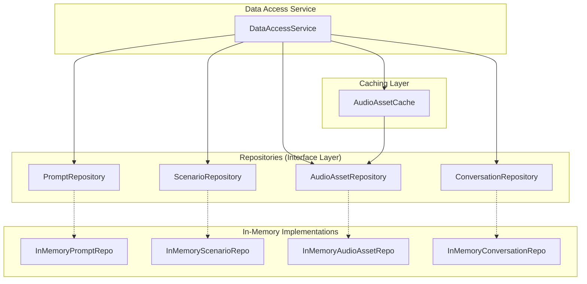
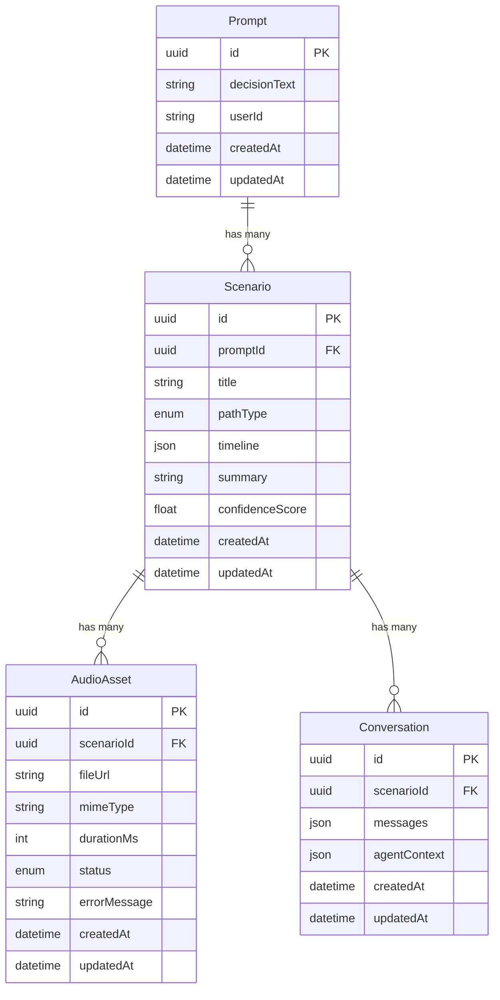

# Design Document: Data Model

## Overview

The Data Model module provides the persistence and data layer for the Decision Intelligence Engine. It defines entity schemas (Prompt, Scenario, Audio_Asset, Conversation), repository interfaces for CRUD operations, and an in-memory MVP implementation using Map-based collections. A Data Access Service orchestrates cross-repository operations, enforces referential integrity with cascade deletes, and provides a caching layer for audio assets.

Technology stack: TypeScript/Node.js with Zod for schema validation, UUID for entity identifiers, fast-check for property-based testing, and Vitest for unit testing.

## Architecture



### Key Design Decisions

1. **Repository pattern**: Each entity has a repository interface. Implementations can be swapped (in-memory for MVP, database later) without changing consumers.
2. **Zod for validation**: All entities are validated at the boundary (creation/update) using Zod schemas. TypeScript types are inferred from schemas.
3. **Data Access Service as orchestrator**: The service layer coordinates cross-repository operations (cascade deletes, referential integrity checks) rather than embedding this logic in individual repositories.
4. **Cache-aside pattern for audio**: The AudioAssetCache wraps the AudioAssetRepository, caching results on read and invalidating on write. This avoids coupling cache logic into the repository implementation.
5. **UUID for all IDs**: All entity IDs are UUIDs generated at creation time, ensuring global uniqueness.

## Components and Interfaces

### 1. Entity Schemas (Zod)

All entities share common fields: `id` (UUID), `createdAt` (ISO 8601), `updatedAt` (ISO 8601).

```typescript
// Base fields shared by all entities
const BaseEntitySchema = z.object({
  id: z.string().uuid(),
  createdAt: z.string().datetime(),
  updatedAt: z.string().datetime(),
});
```

### 2. Repository Interface

A generic repository interface for CRUD operations:

```typescript
interface Repository<T> {
  create(entity: T): Promise<T>;
  getById(id: string): Promise<T | null>;
  update(id: string, entity: Partial<T>): Promise<T>;
  delete(id: string): Promise<void>;
}
```

Entity-specific repositories extend this with query methods:

```typescript
interface PromptRepository extends Repository<Prompt> {}

interface ScenarioRepository extends Repository<Scenario> {
  getByPromptId(promptId: string): Promise<Scenario[]>;
}

interface AudioAssetRepository extends Repository<AudioAsset> {
  getByScenarioId(scenarioId: string): Promise<AudioAsset[]>;
}

interface ConversationRepository extends Repository<Conversation> {
  getByScenarioId(scenarioId: string): Promise<Conversation[]>;
}
```

### 3. In-Memory Repository Implementation

Each in-memory repository uses a `Map<string, T>` as the backing store:

```typescript
class InMemoryPromptRepo implements PromptRepository {
  private store = new Map<string, Prompt>();

  async create(entity: Prompt): Promise<Prompt> {
    const validated = PromptSchema.parse(entity);
    this.store.set(validated.id, validated);
    return validated;
  }

  async getById(id: string): Promise<Prompt | null> {
    return this.store.get(id) ?? null;
  }

  async update(id: string, data: Partial<Prompt>): Promise<Prompt> {
    const existing = this.store.get(id);
    if (!existing) throw new EntityNotFoundError("Prompt", id);
    const updated = PromptSchema.parse({
      ...existing,
      ...data,
      id: existing.id,
      updatedAt: new Date().toISOString(),
    });
    this.store.set(id, updated);
    return updated;
  }

  async delete(id: string): Promise<void> {
    this.store.delete(id);
  }
}
```

The same pattern applies to `InMemoryScenarioRepo`, `InMemoryAudioAssetRepo`, and `InMemoryConversationRepo`, with additional query methods using `Map` iteration and filtering.

### 4. AudioAssetCache

Wraps an `AudioAssetRepository` with a Map-based cache:

```typescript
class AudioAssetCache {
  private cache = new Map<string, AudioAsset>();
  
  constructor(private repo: AudioAssetRepository) {}

  async getById(id: string): Promise<AudioAsset | null> {
    if (this.cache.has(id)) return this.cache.get(id)!;
    const result = await this.repo.getById(id);
    if (result) this.cache.set(id, result);
    return result;
  }

  async getByScenarioId(scenarioId: string): Promise<AudioAsset[]> {
    const results = await this.repo.getByScenarioId(scenarioId);
    for (const asset of results) {
      this.cache.set(asset.id, asset);
    }
    return results;
  }

  invalidate(id: string): void {
    this.cache.delete(id);
  }

  clear(): void {
    this.cache.clear();
  }
}
```

### 5. DataAccessService

Orchestrates cross-repository operations:

```typescript
class DataAccessService {
  constructor(
    private prompts: PromptRepository,
    private scenarios: ScenarioRepository,
    private audioAssets: AudioAssetRepository,
    private conversations: ConversationRepository,
    private audioCache: AudioAssetCache,
  ) {}

  // Prompt operations
  async createPrompt(data: PromptInput): Promise<Prompt>;
  async getPrompt(id: string): Promise<Prompt | null>;
  async updatePrompt(id: string, data: Partial<PromptInput>): Promise<Prompt>;
  async deletePrompt(id: string): Promise<void>; // cascade deletes scenarios

  // Scenario operations (checks prompt exists)
  async createScenario(data: ScenarioInput): Promise<Scenario>;
  async getScenario(id: string): Promise<Scenario | null>;
  async getScenariosByPromptId(promptId: string): Promise<Scenario[]>;
  async updateScenario(id: string, data: Partial<ScenarioInput>): Promise<Scenario>;
  async deleteScenario(id: string): Promise<void>; // cascade deletes audio + conversations

  // Audio asset operations (checks scenario exists, uses cache)
  async createAudioAsset(data: AudioAssetInput): Promise<AudioAsset>;
  async getAudioAsset(id: string): Promise<AudioAsset | null>;
  async getAudioAssetsByScenarioId(scenarioId: string): Promise<AudioAsset[]>;
  async updateAudioAsset(id: string, data: Partial<AudioAssetInput>): Promise<AudioAsset>;
  async deleteAudioAsset(id: string): Promise<void>;

  // Conversation operations (checks scenario exists)
  async createConversation(data: ConversationInput): Promise<Conversation>;
  async getConversation(id: string): Promise<Conversation | null>;
  async getConversationsByScenarioId(scenarioId: string): Promise<Conversation[]>;
  async updateConversation(id: string, data: Partial<ConversationInput>): Promise<Conversation>;
  async deleteConversation(id: string): Promise<void>;
}
```

### 6. EntitySerializer

Handles JSON serialization/deserialization for all entity types:

```typescript
class EntitySerializer {
  static serializePrompt(prompt: Prompt): string;
  static deserializePrompt(json: string): Prompt;

  static serializeScenario(scenario: Scenario): string;
  static deserializeScenario(json: string): Scenario;

  static serializeAudioAsset(asset: AudioAsset): string;
  static deserializeAudioAsset(json: string): AudioAsset;

  static serializeConversation(conversation: Conversation): string;
  static deserializeConversation(json: string): Conversation;
}
```

Each `serialize` method calls `JSON.stringify`. Each `deserialize` method calls `JSON.parse` followed by Zod schema validation, returning descriptive errors on failure.

## Data Models

### Prompt

```typescript
const PromptSchema = z.object({
  id: z.string().uuid(),
  decisionText: z.string().min(1),
  userId: z.string().min(1).optional(), // optional for MVP anonymous sessions
  createdAt: z.string().datetime(),
  updatedAt: z.string().datetime(),
});

type Prompt = z.infer<typeof PromptSchema>;
```

### Scenario

```typescript
const EmotionalToneSchema = z.enum([
  "hopeful", "anxious", "triumphant", "melancholic",
  "neutral", "excited", "fearful", "content",
  "desperate", "relieved",
]);

const TimelineEntrySchema = z.object({
  year: z.string().min(1),
  event: z.string().min(1),
  emotion: EmotionalToneSchema,
});

const PathTypeSchema = z.enum([
  "optimistic", "pessimistic", "pragmatic", "wildcard",
]);

const ScenarioSchema = z.object({
  id: z.string().uuid(),
  promptId: z.string().uuid(),
  title: z.string().min(1),
  pathType: PathTypeSchema,
  timeline: z.array(TimelineEntrySchema).min(3),
  summary: z.string().min(1),
  confidenceScore: z.number().min(0).max(1),
  createdAt: z.string().datetime(),
  updatedAt: z.string().datetime(),
});

type Scenario = z.infer<typeof ScenarioSchema>;
```

### AudioAsset

```typescript
const AudioStatusSchema = z.enum([
  "pending", "generating", "completed", "failed",
]);

const AudioAssetSchema = z.object({
  id: z.string().uuid(),
  scenarioId: z.string().uuid(),
  fileUrl: z.string().url().optional(),  // null until generation completes
  mimeType: z.string().min(1).optional(),
  durationMs: z.number().int().nonnegative().optional(),
  status: AudioStatusSchema,
  errorMessage: z.string().optional(),
  createdAt: z.string().datetime(),
  updatedAt: z.string().datetime(),
});

type AudioAsset = z.infer<typeof AudioAssetSchema>;
```

### Conversation

```typescript
const MessageRoleSchema = z.enum(["user", "assistant", "system"]);

const MessageSchema = z.object({
  role: MessageRoleSchema,
  content: z.string().min(1),
  timestamp: z.string().datetime(),
});

const ConversationSchema = z.object({
  id: z.string().uuid(),
  scenarioId: z.string().uuid(),
  messages: z.array(MessageSchema),
  agentContext: z.record(z.unknown()).optional(), // flexible metadata for agent state
  createdAt: z.string().datetime(),
  updatedAt: z.string().datetime(),
});

type Conversation = z.infer<typeof ConversationSchema>;
```

### Entity Relationships



## Correctness Properties

*A property is a characteristic or behavior that should hold true across all valid executions of a system — essentially, a formal statement about what the system should do. Properties serve as the bridge between human-readable specifications and machine-verifiable correctness guarantees.*

### Property 1: CRUD round-trip

*For any* valid entity (Prompt, Scenario, AudioAsset, or Conversation), creating it and then retrieving it by ID SHALL return an entity equivalent to the one that was created.

**Validates: Requirements 1.1, 1.2, 2.1, 2.2, 3.1, 3.2, 4.1, 4.2**

### Property 2: Update persistence

*For any* existing entity and any valid partial update, updating the entity and then retrieving it by ID SHALL return the updated fields and an updatedAt timestamp that is equal to or later than the original.

**Validates: Requirements 1.3, 2.4, 3.4, 4.4**

### Property 3: Delete removes entity

*For any* existing entity, deleting it by ID and then retrieving it by ID SHALL return null (not found).

**Validates: Requirements 3.5, 4.5**

### Property 4: Query by parent returns all children

*For any* parent entity with N child entities created against it, querying children by the parent's ID SHALL return exactly those N children and no others.

**Validates: Requirements 2.3, 3.3, 4.3**

### Property 5: Referential integrity rejection

*For any* child entity (Scenario, AudioAsset, or Conversation) submitted with a parent ID that does not exist in the store, creation SHALL be rejected with a referential integrity error.

**Validates: Requirements 2.6, 3.6, 4.6, 6.3, 6.4, 6.5**

### Property 6: Cascade delete removes all descendants

*For any* Prompt with associated Scenarios (and their AudioAssets and Conversations), deleting the Prompt SHALL remove the Prompt, all its Scenarios, and all AudioAssets and Conversations belonging to those Scenarios. Similarly, deleting a Scenario SHALL remove all its AudioAssets and Conversations.

**Validates: Requirements 1.4, 2.5, 6.1, 6.2**

### Property 7: Cache hit avoids store access

*For any* AudioAsset that has been retrieved once, a subsequent retrieval by the same ID SHALL return the cached result without querying the backing repository.

**Validates: Requirements 5.1, 5.2**

### Property 8: Cache invalidation on mutation

*For any* cached AudioAsset, updating or deleting it SHALL invalidate the cache entry so that the next retrieval fetches from the backing store.

**Validates: Requirements 5.3, 5.4**

### Property 9: Cache population from query

*For any* set of AudioAssets returned by a query-by-scenario-ID, each individual AudioAsset SHALL be cached so that subsequent getById calls return the cached result without querying the backing store.

**Validates: Requirements 5.5**

### Property 10: Serialization round-trip

*For any* valid entity object (Prompt, Scenario, AudioAsset, or Conversation), serializing it to JSON and then deserializing the JSON back SHALL produce an object equivalent to the original.

**Validates: Requirements 7.1, 7.2, 7.3, 7.4, 7.5**

### Property 11: Invalid JSON deserialization returns errors

*For any* JSON string that does not conform to an entity schema (missing required fields, wrong types, invalid UUIDs, invalid timestamps), deserialization SHALL return a descriptive parsing error rather than an entity object.

**Validates: Requirements 7.6**

### Property 12: Schema validation rejects invalid entities with field-level errors

*For any* entity object with at least one invalid field (empty required string, non-UUID id, non-ISO-8601 timestamp, out-of-range number), validation SHALL reject it and return errors identifying the specific failing fields.

**Validates: Requirements 1.5, 8.1, 8.2, 8.3, 8.4**

## Error Handling

### Entity Not Found

| Error Condition | Response |
|---|---|
| getById with non-existent ID | Return `null` |
| update with non-existent ID | Throw `EntityNotFoundError` with entity type and ID |
| delete with non-existent ID | No-op (idempotent) |

### Referential Integrity Errors

| Error Condition | Response |
|---|---|
| Create Scenario with non-existent promptId | Throw `ReferentialIntegrityError` with message identifying the missing parent |
| Create AudioAsset with non-existent scenarioId | Throw `ReferentialIntegrityError` with message identifying the missing parent |
| Create Conversation with non-existent scenarioId | Throw `ReferentialIntegrityError` with message identifying the missing parent |

### Validation Errors

| Error Condition | Response |
|---|---|
| Entity fails Zod schema validation | Throw `ValidationError` with field-level error details from Zod |
| Invalid UUID format | Throw `ValidationError` identifying the ID field |
| Invalid ISO 8601 timestamp | Throw `ValidationError` identifying the timestamp field |

### Deserialization Errors

| Error Condition | Response |
|---|---|
| Invalid JSON syntax | Throw `DeserializationError` with JSON parse error details |
| Valid JSON, invalid schema | Throw `DeserializationError` with Zod validation error details |

## Testing Strategy

### Property-Based Testing

Library: **fast-check** (TypeScript property-based testing library)

Each correctness property will be implemented as a single property-based test with a minimum of 100 iterations. Tests will be tagged with:

```
Feature: data-model, Property N: <property title>
```

Property tests will use fast-check arbitraries to generate:
- Random valid entity objects (Prompts, Scenarios, AudioAssets, Conversations)
- Random invalid entity objects (missing fields, wrong types, invalid UUIDs)
- Random partial update objects
- Random JSON strings (valid and invalid)

### Unit Testing

Framework: **Vitest**

Unit tests complement property tests by covering:
- Specific CRUD operation examples
- Edge cases (empty collections, duplicate IDs)
- Error condition specifics (exact error messages, error types)
- Cache behavior with controlled sequences of operations
- Cascade delete with multi-level hierarchies

### Test Organization

```
src/
  data-model/
    __tests__/
      schemas.test.ts              # Unit + property tests for Zod schemas
      prompt-repo.test.ts          # Unit + property tests for PromptRepository
      scenario-repo.test.ts        # Unit + property tests for ScenarioRepository
      audio-asset-repo.test.ts     # Unit + property tests for AudioAssetRepository
      conversation-repo.test.ts    # Unit + property tests for ConversationRepository
      audio-cache.test.ts          # Unit + property tests for AudioAssetCache
      data-access-service.test.ts  # Integration tests for DataAccessService
      serializer.test.ts           # Unit + property tests for EntitySerializer
```

### Test Coverage Goals

- All 12 correctness properties implemented as property-based tests
- Unit tests for each repository's edge cases and error paths
- Integration tests for cascade deletes and referential integrity through DataAccessService
