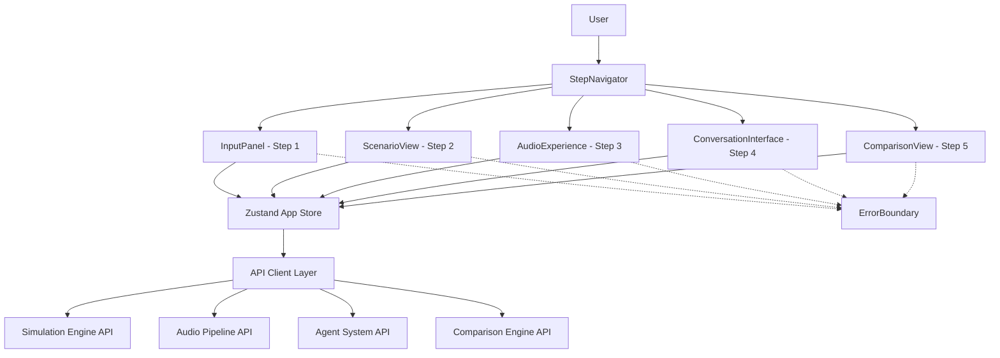

# Design Document: Frontend Experience

## Overview

The Frontend Experience provides the user-facing interface for the Decision Intelligence Engine. It guides users through a five-step flow — input a decision, view generated futures, play audio experiences, converse with future-self characters, and compare scenarios — all within a responsive, accessible React/Next.js application.

The architecture follows a step-based navigation pattern with a centralized Zustand store managing global state. Each step maps to a primary component that communicates with backend services through a unified API client layer. All async operations surface loading and error states consistently.

Technology stack: Next.js 14+ (App Router), TypeScript, Tailwind CSS, Zustand for state management, fast-check for property-based testing, Vitest + React Testing Library for unit/component testing.

## Architecture



### Key Design Decisions

1. **Zustand over React Context**: Zustand provides a simpler API with built-in selector support for preventing unnecessary re-renders. It also supports serialization/deserialization for state persistence and debugging.
2. **Step-based navigation with completion gating**: Forward navigation is gated by step completion state, preventing users from skipping steps. Backward navigation is always allowed to completed steps.
3. **Unified API client**: A single API client module handles all backend communication with consistent error transformation, timeout handling, and request headers. This avoids duplicated fetch logic across components.
4. **Error boundaries per section**: Each major step component is wrapped in an Error Boundary to isolate rendering failures and provide graceful fallback UI without crashing the entire application.
5. **Component-level loading/error states**: Each step component manages its own loading and error states derived from the Zustand store, ensuring consistent UX patterns across all async operations.
6. **CSS-first animations**: Step transitions and card entrance animations use Tailwind CSS transitions and `framer-motion` for orchestrated animations, keeping animation logic out of component state.

## Components and Interfaces

### 1. StepNavigator

Controls the five-step flow and renders step indicators.

```typescript
interface StepNavigatorProps {
  currentStep: Step;
  completedSteps: Set<Step>;
  onStepChange: (step: Step) => void;
}

type Step = "decision-input" | "scenario-view" | "audio-experience" | "conversation" | "comparison";

const STEP_ORDER: Step[] = [
  "decision-input",
  "scenario-view",
  "audio-experience",
  "conversation",
  "comparison",
];
```

- Renders a horizontal step indicator bar (vertical on mobile)
- Each step shows: label, step number, visual state (current / completed / locked)
- Forward navigation enabled only when current step is completed
- Backward navigation allowed to any completed step
- Uses `aria-current="step"` for accessibility

### 2. InputPanel

Accepts decision input via text or voice.

```typescript
interface InputPanelProps {
  onSubmit: (prompt: string) => void;
  isLoading: boolean;
  error: AppError | null;
  onRetry: () => void;
}
```

- Text input with character count (max 2000)
- Voice recording button using Web Audio API / MediaRecorder
- Client-side validation: rejects empty/whitespace-only input
- Displays loading indicator during API call
- Displays error with retry button on failure
- Submit via Enter key or submit button

### 3. ScenarioCard

Displays a single future scenario.

```typescript
interface ScenarioCardProps {
  scenario: Scenario;
  isSelected: boolean;
  onSelect: (scenarioId: string) => void;
  animationDelay: number;
}

interface Scenario {
  scenario_id: string;
  title: string;
  path_type: "optimistic" | "pessimistic" | "pragmatic" | "wildcard";
  timeline: TimelineEntry[];
  summary: string;
  confidence_score: number;
}

interface TimelineEntry {
  year: string;
  event: string;
  emotion: string;
}
```

- Displays: title, path type badge, emotional tone progression (color-coded dots), timeline summary (first/last events), confidence score bar
- Click/keyboard select triggers `onSelect`
- Selected state shown with border highlight and `aria-selected`
- Staggered entrance animation via `animationDelay`

### 4. AudioPlayer

Plays immersive audio experience for a scenario.

```typescript
interface AudioPlayerProps {
  audioUrl: string | null;
  isLoading: boolean;
  error: AppError | null;
  onRetry: () => void;
  onSkip: () => void;
}
```

- Uses HTML5 `<audio>` element with custom controls
- Play/pause button, seek bar (range input), elapsed/total time display
- Progress indicator synchronized with `timeupdate` events
- Accessible: `aria-label` on controls, text status ("Playing", "Paused", time)
- Loading state while audio is being generated
- Error state with retry and skip-to-next options

### 5. ConversationInterface

Real-time voice conversation with a future-self character.

```typescript
interface ConversationInterfaceProps {
  sessionId: string | null;
  isConnecting: boolean;
  isActive: boolean;
  messages: ConversationMessage[];
  error: AppError | null;
  onStartRecording: () => void;
  onStopRecording: () => void;
  onRetry: () => void;
}

interface ConversationMessage {
  id: string;
  role: "user" | "agent";
  content: string;
  timestamp: Date;
}
```

- Microphone button toggles recording (push-to-talk)
- Live indicator (pulsing dot) when session is active
- Scrollable message list showing conversation history
- Each message shows role icon, content text, timestamp
- Error state with retry connection button
- Uses Web Audio API for audio capture

### 6. ComparisonView

Side-by-side comparison of all scenarios.

```typescript
interface ComparisonViewProps {
  scenarios: Scenario[];
  comparisonData: ComparisonData | null;
  isLoading: boolean;
  error: AppError | null;
  onRetry: () => void;
}

interface ComparisonData {
  metrics: ComparisonMetric[];
  summary: string;
}

interface ComparisonMetric {
  name: string;
  values: { scenarioId: string; value: number; label: string }[];
}
```

- Renders scenarios in columns (stacked on mobile)
- Each column: title, summary, key metrics
- Bar or radar chart comparing metrics across scenarios
- Uses a lightweight chart library (e.g., recharts)
- Loading and error states

### 7. API Client

Centralized backend communication layer.

```typescript
interface ApiClient {
  generateScenarios(prompt: string): Promise<ApiResult<ScenarioSet>>;
  generateAudio(scenarioId: string): Promise<ApiResult<AudioExperience>>;
  startConversation(scenarioId: string): Promise<ApiResult<SessionInfo>>;
  sendVoiceMessage(sessionId: string, audio: Blob): Promise<ApiResult<VoiceResponse>>;
  endConversation(sessionId: string): Promise<ApiResult<void>>;
  getComparison(scenarioIds: string[]): Promise<ApiResult<ComparisonData>>;
}

type ApiResult<T> =
  | { success: true; data: T }
  | { success: false; error: AppError };

interface AppError {
  message: string;
  code?: string;
  isNetworkError: boolean;
}

interface ApiClientConfig {
  baseUrl: string;
  timeoutMs: number; // default 30000
  headers?: Record<string, string>;
}
```

- All methods return `ApiResult<T>` — never throw
- Transforms HTTP errors into standardized `AppError` objects
- Distinguishes network errors (`isNetworkError: true`) from API errors
- Configurable timeout per request
- Includes `Content-Type` and optional auth headers

### 8. Zustand App Store

Global state management.

```typescript
interface AppState {
  // Navigation
  currentStep: Step;
  completedSteps: Set<Step>;

  // Decision Input
  decisionPrompt: string;

  // Scenarios
  scenarioSet: Scenario[] | null;
  selectedScenarioId: string | null;

  // Audio
  audioState: AudioPlaybackState;

  // Conversation
  conversationSession: ConversationSessionState;

  // Comparison
  comparisonData: ComparisonData | null;

  // API states
  apiStates: Record<string, ApiRequestState>;

  // Actions
  setDecisionPrompt: (prompt: string) => void;
  setScenarioSet: (prompt: string, scenarios: Scenario[]) => void;
  selectScenario: (scenarioId: string) => void;
  setCurrentStep: (step: Step) => void;
  completeStep: (step: Step) => void;
  setApiState: (key: string, state: ApiRequestState) => void;
  updateAudioState: (state: Partial<AudioPlaybackState>) => void;
  addConversationMessage: (message: ConversationMessage) => void;
  setComparisonData: (data: ComparisonData) => void;
  serialize: () => string;
  deserialize: (json: string) => void;
}

interface AudioPlaybackState {
  isPlaying: boolean;
  currentTime: number;
  duration: number;
  audioUrl: string | null;
}

interface ConversationSessionState {
  sessionId: string | null;
  isActive: boolean;
  messages: ConversationMessage[];
}

type ApiRequestState =
  | { status: "idle" }
  | { status: "loading" }
  | { status: "success" }
  | { status: "error"; error: AppError };
```

- `setScenarioSet` updates prompt and scenarios atomically
- Selectors for derived state (e.g., `getSelectedScenario`, `isStepCompleted`)
- `serialize`/`deserialize` for state persistence and round-trip testing
- API states tracked per operation key (e.g., "generateScenarios", "generateAudio")

### 9. ErrorBoundary

Catches rendering errors in child components.

```typescript
interface ErrorBoundaryProps {
  fallback: React.ReactNode;
  children: React.ReactNode;
  onError?: (error: Error, errorInfo: React.ErrorInfo) => void;
}
```

- Wraps each step component
- Renders fallback UI on error (e.g., "Something went wrong. Please refresh.")
- Optionally reports errors via `onError` callback
- Resets on navigation to a different step

## Data Models

### Scenario (from Simulation Engine)

```typescript
import { z } from "zod";

const EmotionalToneSchema = z.enum([
  "hopeful", "anxious", "triumphant", "melancholic",
  "neutral", "excited", "fearful", "content",
  "desperate", "relieved",
]);

const TimelineEntrySchema = z.object({
  year: z.string().min(1),
  event: z.string().min(1),
  emotion: EmotionalToneSchema,
});

const PathTypeSchema = z.enum([
  "optimistic", "pessimistic", "pragmatic", "wildcard",
]);

const ScenarioSchema = z.object({
  scenario_id: z.string().min(1),
  title: z.string().min(1),
  path_type: PathTypeSchema,
  timeline: z.array(TimelineEntrySchema).min(3),
  summary: z.string().min(1),
  confidence_score: z.number().min(0).max(1),
});

const ScenarioSetSchema = z.array(ScenarioSchema).min(2).max(4);
```

### App State (Serializable Subset)

```typescript
const StepSchema = z.enum([
  "decision-input", "scenario-view", "audio-experience",
  "conversation", "comparison",
]);

const AppErrorSchema = z.object({
  message: z.string().min(1),
  code: z.string().optional(),
  isNetworkError: z.boolean(),
});

const ApiRequestStateSchema = z.discriminatedUnion("status", [
  z.object({ status: z.literal("idle") }),
  z.object({ status: z.literal("loading") }),
  z.object({ status: z.literal("success") }),
  z.object({ status: z.literal("error"), error: AppErrorSchema }),
]);

const ConversationMessageSchema = z.object({
  id: z.string().min(1),
  role: z.enum(["user", "agent"]),
  content: z.string().min(1),
  timestamp: z.coerce.date(),
});

const SerializableAppStateSchema = z.object({
  currentStep: StepSchema,
  completedSteps: z.array(StepSchema),
  decisionPrompt: z.string(),
  scenarioSet: ScenarioSetSchema.nullable(),
  selectedScenarioId: z.string().nullable(),
  audioState: z.object({
    isPlaying: z.boolean(),
    currentTime: z.number().min(0),
    duration: z.number().min(0),
    audioUrl: z.string().nullable(),
  }),
  conversationSession: z.object({
    sessionId: z.string().nullable(),
    isActive: z.boolean(),
    messages: z.array(ConversationMessageSchema),
  }),
  comparisonData: z.object({
    metrics: z.array(z.object({
      name: z.string().min(1),
      values: z.array(z.object({
        scenarioId: z.string().min(1),
        value: z.number(),
        label: z.string().min(1),
      })),
    })),
    summary: z.string().min(1),
  }).nullable(),
  apiStates: z.record(z.string(), ApiRequestStateSchema),
});
```

### API Response Types

```typescript
const AudioExperienceResponseSchema = z.object({
  scenarioId: z.string().min(1),
  audioUrl: z.string().url(),
  totalDurationMs: z.number().positive(),
  segmentCount: z.number().int().positive(),
});

const SessionInfoSchema = z.object({
  sessionId: z.string().min(1),
  agentId: z.string().min(1),
  status: z.enum(["active", "closed", "expired"]),
});

const VoiceResponseSchema = z.object({
  audioUrl: z.string().url(),
  transcript: z.string().min(1),
});

const ComparisonDataSchema = z.object({
  metrics: z.array(z.object({
    name: z.string().min(1),
    values: z.array(z.object({
      scenarioId: z.string().min(1),
      value: z.number(),
      label: z.string().min(1),
    })),
  })),
  summary: z.string().min(1),
});
```

## Correctness Properties

*A property is a characteristic or behavior that should hold true across all valid executions of a system — essentially, a formal statement about what the system should do. Properties serve as the bridge between human-readable specifications and machine-verifiable correctness guarantees.*

### Property 1: Step navigation enablement follows completion state

*For any* set of completed steps and a current step, the Step_Navigator SHALL enable navigation to step N+1 if and only if step N is completed, and SHALL allow backward navigation to any completed step.

**Validates: Requirements 1.2, 1.3, 1.4**

### Property 2: Whitespace-only input rejection

*For any* string composed entirely of whitespace characters (including empty string), the InputPanel SHALL prevent submission and the App_State SHALL remain unchanged.

**Validates: Requirements 2.4**

### Property 3: Non-empty prompt triggers scenario generation

*For any* non-empty, non-whitespace-only decision prompt string, submitting it SHALL invoke the Simulation_Engine_API with that prompt.

**Validates: Requirements 2.3**

### Property 4: Scenario card count matches scenario set size

*For any* Scenario_Set containing N scenarios (where 2 ≤ N ≤ 4), the Frontend_App SHALL render exactly N ScenarioCard components.

**Validates: Requirements 3.1**

### Property 5: ScenarioCard displays all required fields

*For any* valid Scenario object, the rendered ScenarioCard SHALL contain the scenario's title, path type, emotional tone indicators, timeline summary, and confidence score.

**Validates: Requirements 3.2**

### Property 6: Scenario selection updates App_State

*For any* scenario in the current Scenario_Set, selecting it SHALL set `selectedScenarioId` in App_State to that scenario's ID and mark the Scenario View step as completed.

**Validates: Requirements 3.3**

### Property 7: Conversation history renders all messages in order

*For any* conversation history containing N messages, the ConversationInterface SHALL render all N messages in chronological order, each displaying role, content, and timestamp.

**Validates: Requirements 5.4, 5.5**

### Property 8: ComparisonView displays all scenarios with required fields

*For any* Scenario_Set and ComparisonData, the ComparisonView SHALL display each scenario's title, summary, and all metric values.

**Validates: Requirements 6.2**

### Property 9: AudioPlayer provides text alternatives for all playback states

*For any* AudioPlaybackState (playing, paused, with varying currentTime and duration), the AudioPlayer SHALL render accessible text describing the current state and time position.

**Validates: Requirements 8.5**

### Property 10: API errors display message and retry action

*For any* AppError returned by any backend API, the Frontend_App SHALL display the error's message text and render a retry action element.

**Validates: Requirements 2.6, 4.5, 5.6, 6.5, 9.2**

### Property 11: Loading states display indicator for in-progress APIs

*For any* API operation key in "loading" state, the Frontend_App SHALL render a Loading_Indicator associated with that operation.

**Validates: Requirements 9.1**

### Property 12: App_State serialization round-trip

*For any* valid serializable App_State object, serializing it to JSON and then deserializing SHALL produce an equivalent App_State object.

**Validates: Requirements 11.3**

### Property 13: Atomic state update on prompt submission

*For any* decision prompt string and Scenario_Set, calling `setScenarioSet(prompt, scenarios)` SHALL update both `decisionPrompt` and `scenarioSet` in a single state transition, such that no intermediate state exists where one is updated and the other is not.

**Validates: Requirements 11.2**

### Property 14: API client includes correct headers

*For any* API request made through the API client, the request SHALL include `Content-Type: application/json` and any configured custom headers.

**Validates: Requirements 12.2**

### Property 15: API client transforms errors to standardized format

*For any* HTTP error response (4xx or 5xx status), the API client SHALL return an AppError object containing a non-empty message string and `isNetworkError` set to false. For any network failure, `isNetworkError` SHALL be true.

**Validates: Requirements 12.3**

## Error Handling

### Input Validation Errors

| Error Condition | Component | Response |
|---|---|---|
| Empty/whitespace-only prompt | InputPanel | Display inline validation error, prevent submission |
| Prompt exceeds 2000 characters | InputPanel | Display character count warning, prevent submission |

### API Communication Errors

| Error Condition | Component | Response |
|---|---|---|
| Simulation Engine API failure | InputPanel | Display error message with retry button |
| Audio Pipeline API failure | AudioPlayer | Display error message with retry and skip buttons |
| Agent System API connection failure | ConversationInterface | Display error message with retry button |
| Comparison Engine API failure | ComparisonView | Display error message with retry button |
| Network connectivity loss | All steps | Display "No internet connection" banner with retry |
| Request timeout (>30s) | API Client | Return timeout-specific AppError |

### Rendering Errors

| Error Condition | Component | Response |
|---|---|---|
| Component render crash | ErrorBoundary | Display fallback UI: "Something went wrong" with refresh suggestion |
| Invalid scenario data | ScenarioCard | ErrorBoundary catches, displays fallback |
| Audio element error | AudioPlayer | Display "Audio unavailable" with retry option |

### State Errors

| Error Condition | Component | Response |
|---|---|---|
| Deserialization failure | App Store | Reset to initial state, log warning |
| Invalid step transition | StepNavigator | Ignore invalid navigation, log warning |

## Testing Strategy

### Property-Based Testing

Library: **fast-check** (TypeScript property-based testing library)

Each correctness property will be implemented as a single property-based test with a minimum of 100 iterations. Tests will be tagged with:

```
Feature: frontend-experience, Property N: <property title>
```

Property tests will use fast-check arbitraries to generate:
- Random step completion states (subsets of the 5 steps)
- Random whitespace strings (spaces, tabs, newlines, mixed)
- Random valid Scenario objects and ScenarioSets (2-4 scenarios)
- Random ConversationMessage arrays with varying lengths
- Random AppError objects with varying message/code/isNetworkError
- Random AudioPlaybackState objects
- Random serializable AppState objects
- Random HTTP error responses (status codes, bodies)

Key generators:
- `stepCompletionArbitrary`: generates random `Set<Step>` subsets
- `whitespaceStringArbitrary`: generates strings of only whitespace characters
- `scenarioArbitrary`: generates valid Scenario objects (reuse from simulation-engine)
- `scenarioSetArbitrary`: generates arrays of 2-4 valid scenarios
- `conversationMessageArbitrary`: generates message arrays with random roles/content
- `appStateArbitrary`: generates valid serializable AppState objects
- `appErrorArbitrary`: generates AppError objects with random messages and codes

### Unit Testing

Framework: **Vitest** + **React Testing Library**

Unit tests complement property tests by covering:
- Specific rendering examples (e.g., InputPanel renders text field and voice button)
- Component interaction examples (e.g., clicking submit calls onSubmit)
- Error boundary behavior with thrown errors
- Loading indicator rendering during API calls
- Keyboard navigation for interactive elements
- Specific API client behavior (timeout, network error vs API error)
- Staggered animation delay calculation

### Test Organization

```
src/
  components/
    __tests__/
      StepNavigator.test.tsx       # Unit + property tests
      InputPanel.test.tsx          # Unit + property tests
      ScenarioCard.test.tsx        # Unit + property tests
      AudioPlayer.test.tsx         # Unit + property tests
      ConversationInterface.test.tsx # Unit + property tests
      ComparisonView.test.tsx      # Unit + property tests
      ErrorBoundary.test.tsx       # Unit tests
  store/
    __tests__/
      app-store.test.ts            # Unit + property tests for Zustand store
  api/
    __tests__/
      api-client.test.ts           # Unit + property tests for API client
```

### Test Coverage Goals

- All 15 correctness properties implemented as property-based tests
- Unit tests for each component's rendering, interaction, and edge cases
- API client tests with mocked fetch for all error scenarios
- Store tests for all state transitions and serialization
