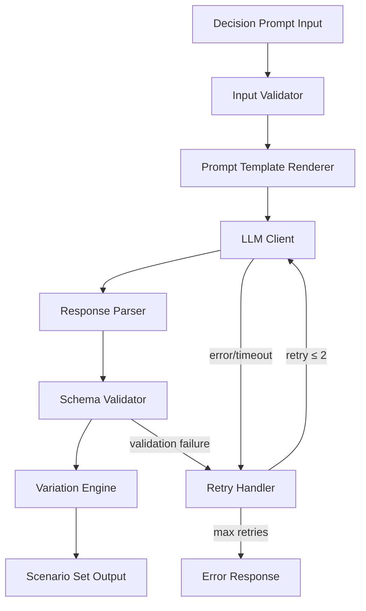

# Design Document: Simulation Engine

## Overview

The Simulation Engine is the core module of the Decision Intelligence Engine. It accepts a decision prompt, orchestrates LLM-based narrative generation through structured prompt templates, validates outputs against a JSON schema, and ensures diversity across generated scenarios using a variation engine.

The architecture follows a pipeline pattern: input validation → prompt rendering → LLM generation → output parsing → schema validation → diversity verification. Each stage is a discrete, testable component with clear interfaces.

Technology stack: TypeScript/Node.js with Zod for schema validation and a property-based testing library (fast-check) for correctness verification.

## Architecture



The pipeline is orchestrated by a central `SimulationEngine` class that coordinates the flow. Each component is injected as a dependency, enabling testability and modularity.

### Key Design Decisions

1. **Pipeline over event-driven**: A synchronous pipeline is simpler, easier to test, and sufficient for demo performance. Each stage transforms data and passes it forward.
2. **Zod for validation**: Zod provides runtime schema validation with TypeScript type inference, eliminating the need for separate type definitions and validation logic.
3. **Dependency injection for LLM Client**: The LLM client is injected as an interface, allowing easy mocking in tests and swapping providers.
4. **Per-path-type generation**: Each scenario is generated with a separate LLM call specifying the desired path type, rather than asking the LLM to generate all scenarios at once. This gives more control over diversity and allows targeted retries.

## Components and Interfaces

### 1. InputValidator

Validates incoming decision prompts before processing.

```typescript
interface InputValidator {
  validate(prompt: string): ValidationResult;
}

type ValidationResult =
  | { valid: true; sanitizedPrompt: string }
  | { valid: false; error: string };
```

- Rejects empty/whitespace-only strings
- Rejects prompts exceeding 2000 characters
- Trims and sanitizes accepted prompts

### 2. PromptTemplateRenderer

Renders prompt templates by substituting placeholders with actual values.

```typescript
interface PromptTemplateRenderer {
  render(template: PromptTemplate, variables: TemplateVariables): string;
}

interface PromptTemplate {
  templateId: string;
  templateText: string; // Contains {{decision_prompt}} and {{path_type}} placeholders
}

interface TemplateVariables {
  decisionPrompt: string;
  pathType: PathType;
}
```

- Deterministic: same inputs always produce the same output string
- Replaces all `{{placeholder}}` tokens with corresponding values
- Includes JSON schema instructions in the template so the LLM knows the expected output format

### 3. LLMClient

Interface for communicating with an external LLM provider.

```typescript
interface LLMClient {
  generate(prompt: string): Promise<LLMResponse>;
}

type LLMResponse =
  | { success: true; content: string }
  | { success: false; error: string };
```

- Abstracts the LLM provider (OpenAI GPT-4 or any compatible API)
- Returns raw string content on success
- Returns descriptive error on failure or timeout

### 4. ResponseParser

Parses raw LLM string output into structured Scenario objects.

```typescript
interface ResponseParser {
  parse(raw: string): ParseResult;
}

type ParseResult =
  | { success: true; scenario: Scenario }
  | { success: false; error: string };
```

- Extracts JSON from LLM response (handles markdown code fences, extra text)
- Attempts `JSON.parse` and maps to Scenario structure
- Returns descriptive error if parsing fails

### 5. SchemaValidator

Validates parsed Scenario objects against the Zod schema.

```typescript
interface SchemaValidator {
  validate(scenario: Scenario): SchemaValidationResult;
}

type SchemaValidationResult =
  | { valid: true; scenario: Scenario }
  | { valid: false; errors: SchemaError[] };

interface SchemaError {
  field: string;
  message: string;
}
```

- Uses Zod schema to validate all fields
- Returns granular field-level errors
- Checks confidence_score range (0–1), non-empty timeline, non-empty title/summary

### 6. VariationEngine

Ensures diversity across a set of generated scenarios.

```typescript
interface VariationEngine {
  verify(scenarios: Scenario[]): VariationResult;
  selectPathTypes(count: number): PathType[];
}

type VariationResult =
  | { diverse: true }
  | { diverse: false; reason: string };

type PathType = "optimistic" | "pessimistic" | "pragmatic" | "wildcard";
```

- `selectPathTypes`: selects `count` unique path types for generation (2–4)
- `verify`: checks that path types are unique, final emotional tones differ for at least two scenarios, and summaries are not duplicated

### 7. SimulationEngine (Orchestrator)

Central orchestrator that coordinates the full pipeline.

```typescript
interface SimulationEngineConfig {
  scenarioCount: number; // 2–4, default 3
  maxRetries: number;    // default 2
}

interface SimulationEngine {
  simulate(prompt: string, config?: Partial<SimulationEngineConfig>): Promise<SimulationResult>;
}

type SimulationResult =
  | { success: true; scenarios: Scenario[] }
  | { success: false; error: string };
```

- Validates input → selects path types → generates each scenario via LLM → validates → verifies diversity
- Retries individual scenario generation on failure (up to maxRetries)
- Returns the full scenario set or a descriptive error

### 8. ScenarioSerializer

Handles JSON serialization and deserialization of Scenario objects.

```typescript
interface ScenarioSerializer {
  serialize(scenario: Scenario): string;
  deserialize(json: string): ParseResult;
}
```

- `serialize`: converts a Scenario to a JSON string
- `deserialize`: parses a JSON string and validates it against the schema
- Round-trip property: `deserialize(serialize(scenario))` equals the original scenario

## Data Models

### Scenario

```typescript
import { z } from "zod";

const EmotionalToneSchema = z.enum([
  "hopeful", "anxious", "triumphant", "melancholic",
  "neutral", "excited", "fearful", "content",
  "desperate", "relieved"
]);

const TimelineEntrySchema = z.object({
  year: z.string().min(1),
  event: z.string().min(1),
  emotion: EmotionalToneSchema,
});

const PathTypeSchema = z.enum([
  "optimistic", "pessimistic", "pragmatic", "wildcard"
]);

const ScenarioSchema = z.object({
  scenario_id: z.string().min(1),
  title: z.string().min(1),
  path_type: PathTypeSchema,
  timeline: z.array(TimelineEntrySchema).min(3),
  summary: z.string().min(1),
  confidence_score: z.number().min(0).max(1),
});

const ScenarioSetSchema = z.array(ScenarioSchema).min(2).max(4);

type EmotionalTone = z.infer<typeof EmotionalToneSchema>;
type TimelineEntry = z.infer<typeof TimelineEntrySchema>;
type PathType = z.infer<typeof PathTypeSchema>;
type Scenario = z.infer<typeof ScenarioSchema>;
type ScenarioSet = z.infer<typeof ScenarioSetSchema>;
```

### Prompt Template

```typescript
interface PromptTemplate {
  templateId: string;
  templateText: string;
}
```

A default template would look like:

```
You are a future scenario generator. Given a decision, generate a {{path_type}} future scenario.

Decision: {{decision_prompt}}

Respond with a JSON object matching this schema:
{
  "scenario_id": "unique string",
  "title": "scenario title",
  "path_type": "{{path_type}}",
  "timeline": [
    { "year": "year or milestone", "event": "description", "emotion": "emotional tone" }
  ],
  "summary": "outcome summary",
  "confidence_score": 0.0 to 1.0
}

Include at least 3 timeline entries. The emotional tone must be one of: hopeful, anxious, triumphant, melancholic, neutral, excited, fearful, content, desperate, relieved.
```


## Correctness Properties

*A property is a characteristic or behavior that should hold true across all valid executions of a system — essentially, a formal statement about what the system should do. Properties serve as the bridge between human-readable specifications and machine-verifiable correctness guarantees.*

### Property 1: Valid input acceptance

*For any* non-empty, non-whitespace-only string of 2000 characters or fewer, the InputValidator SHALL accept it and return a valid result with a sanitized prompt.

**Validates: Requirements 1.1**

### Property 2: Invalid input rejection

*For any* string that is empty, composed entirely of whitespace, or exceeds 2000 characters, the InputValidator SHALL reject it and return a descriptive validation error.

**Validates: Requirements 1.2, 1.3**

### Property 3: Scenario count invariant

*For any* valid decision prompt and any configured scenario count N (where 2 ≤ N ≤ 4), the Simulation_Engine SHALL produce exactly N scenarios in the output set.

**Validates: Requirements 2.1**

### Property 4: Unique path types in scenario set

*For any* generated Scenario_Set, all scenarios SHALL have distinct Path_Type values — no two scenarios share the same path type.

**Validates: Requirements 2.2, 2.3, 5.1**

### Property 5: Emotional tone diversity

*For any* generated Scenario_Set containing 2 or more scenarios, at least two scenarios SHALL have different final Emotional_Tone values in their timelines.

**Validates: Requirements 2.4, 5.2**

### Property 6: Valid scenarios pass schema validation

*For any* Scenario object that has a non-empty scenario_id, non-empty title, a valid path_type, a timeline with at least 3 entries (each with non-empty year, event, and valid emotion), a non-empty summary, and a confidence_score in [0, 1], the SchemaValidator SHALL accept it as valid.

**Validates: Requirements 3.1, 3.2, 3.3, 3.4, 3.5, 4.1**

### Property 7: Invalid scenarios fail schema validation with field-level errors

*For any* Scenario object with at least one invalid field (confidence_score outside [0,1], empty timeline, missing timeline entry fields, empty title, or empty summary), the SchemaValidator SHALL reject it and return errors referencing the specific failing fields.

**Validates: Requirements 4.2, 4.3, 4.4, 4.5**

### Property 8: Template rendering replaces all placeholders

*For any* PromptTemplate containing `{{decision_prompt}}` and `{{path_type}}` placeholders, and *for any* non-empty decision prompt string and valid PathType, rendering the template SHALL produce a string containing no remaining `{{...}}` placeholder tokens.

**Validates: Requirements 7.2**

### Property 9: Template rendering is deterministic

*For any* PromptTemplate, decision prompt string, and PathType, rendering the template twice with the same inputs SHALL produce identical output strings.

**Validates: Requirements 7.4**

### Property 10: Scenario serialization round-trip

*For any* valid Scenario object, serializing it to JSON and then deserializing the JSON back SHALL produce a Scenario object equivalent to the original.

**Validates: Requirements 8.3**

### Property 11: Invalid JSON deserialization returns errors

*For any* JSON string that does not conform to the Scenario schema (missing required fields, wrong types, out-of-range values), deserialization SHALL return a descriptive parsing error rather than a Scenario object.

**Validates: Requirements 8.4**

### Property 12: LLM errors produce graceful failure

*For any* error response from the LLM_Client (network error, timeout, malformed response), the Simulation_Engine SHALL return a descriptive error result without throwing an unhandled exception.

**Validates: Requirements 6.4**

### Property 13: Scenario summaries are non-duplicated

*For any* generated Scenario_Set, no two scenarios SHALL have identical summary strings.

**Validates: Requirements 5.3**

## Error Handling

### Input Validation Errors

| Error Condition | Response |
|---|---|
| Empty or whitespace-only prompt | `{ valid: false, error: "Decision prompt must not be empty" }` |
| Prompt exceeds 2000 characters | `{ valid: false, error: "Decision prompt must not exceed 2000 characters" }` |

### LLM Client Errors

| Error Condition | Response |
|---|---|
| LLM API timeout | Retry up to 2 times, then return `{ success: false, error: "LLM request timed out after 3 attempts" }` |
| LLM API error (rate limit, auth, etc.) | Return `{ success: false, error: "LLM service error: <details>" }` |
| LLM returns non-JSON response | Retry up to 2 times, then return `{ success: false, error: "Failed to parse LLM response after 3 attempts" }` |

### Schema Validation Errors

| Error Condition | Response |
|---|---|
| Missing required field | `{ valid: false, errors: [{ field: "<field_name>", message: "Required" }] }` |
| confidence_score out of range | `{ valid: false, errors: [{ field: "confidence_score", message: "Must be between 0 and 1" }] }` |
| Empty timeline | `{ valid: false, errors: [{ field: "timeline", message: "Must contain at least 3 entries" }] }` |
| Invalid emotional tone | `{ valid: false, errors: [{ field: "timeline[n].emotion", message: "Must be a valid emotional tone" }] }` |

### Deserialization Errors

| Error Condition | Response |
|---|---|
| Invalid JSON syntax | `{ success: false, error: "Invalid JSON: <parse error details>" }` |
| Valid JSON, invalid schema | `{ success: false, error: "Schema validation failed: <field errors>" }` |

### Variation Engine Errors

| Error Condition | Response |
|---|---|
| Duplicate path types detected | `{ diverse: false, reason: "Duplicate path types found" }` |
| Identical emotional tone progressions | `{ diverse: false, reason: "Insufficient emotional tone diversity" }` |
| Duplicate summaries | `{ diverse: false, reason: "Duplicate scenario summaries detected" }` |

## Testing Strategy

### Property-Based Testing

Library: **fast-check** (TypeScript property-based testing library)

Each correctness property from the design document will be implemented as a single property-based test with a minimum of 100 iterations. Tests will be tagged with the format:

```
Feature: simulation-engine, Property N: <property title>
```

Property tests will use fast-check arbitraries to generate:
- Random valid/invalid decision prompt strings
- Random valid/invalid Scenario objects
- Random PromptTemplate instances with placeholder variations
- Random PathType selections

### Unit Testing

Framework: **Vitest**

Unit tests complement property tests by covering:
- Specific examples demonstrating correct behavior (e.g., a known good scenario passes validation)
- Integration points between components (e.g., orchestrator calls LLM client with rendered prompt)
- Edge cases (e.g., empty timeline array, exactly 2000 character prompt)
- Error conditions (e.g., LLM timeout, retry exhaustion)
- Mock-based tests for LLM client interactions

### Test Organization

```
src/
  simulation-engine/
    __tests__/
      input-validator.test.ts        # Unit + property tests for InputValidator
      prompt-template.test.ts        # Unit + property tests for PromptTemplateRenderer
      schema-validator.test.ts       # Unit + property tests for SchemaValidator
      variation-engine.test.ts       # Unit + property tests for VariationEngine
      scenario-serializer.test.ts    # Unit + property tests for ScenarioSerializer
      simulation-engine.test.ts      # Integration tests for orchestrator
```

### Test Coverage Goals

- All 13 correctness properties implemented as property-based tests
- Unit tests for each component's edge cases and error paths
- Integration tests for the full pipeline with mocked LLM client
